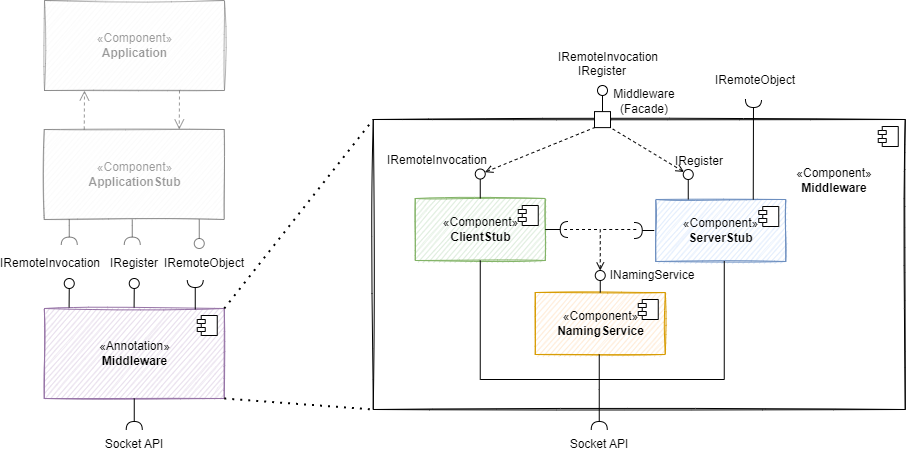
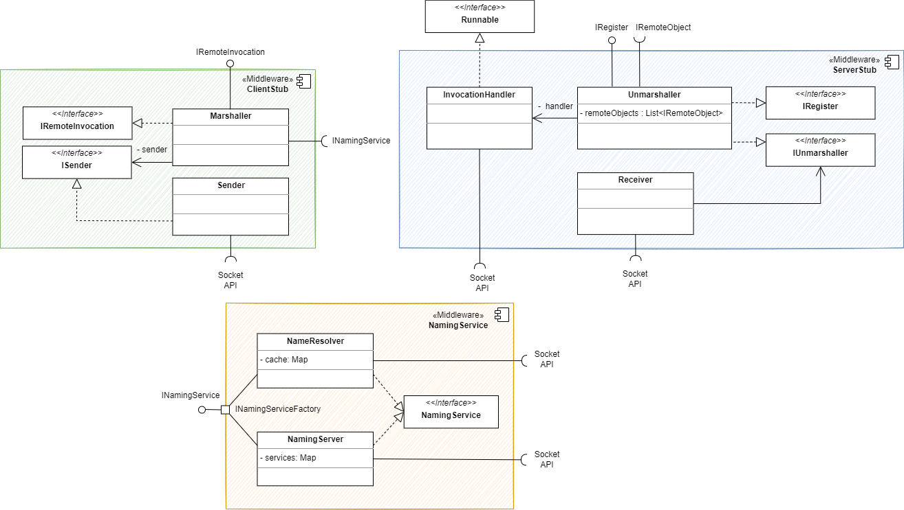

[[_TOC_]]

# 1. Einführung und Ziele

In diesem Dokument wird eine Middleware für die Applikation Tron beschrieben.

## 1.1 Aufgabenstellung

Die Middleware bildet eine Zwischenschicht zwischen der Applikation und dem Betriebssystem. Sie soll den Aufruf von Funktionen zwischen voneinander unabhängigen Nodes ermöglichen:
- Sie bietet der Applikation eine einfache Schnittstelle zum Aufrufen von Funktionen.
- Sie verpackt diese Aufrufe in Nachrichten und versendet sie über das Netzwerk.
- Sie entpackt Nachrichten aus dem Netzwerk und gibt sie an die Applikation weiter.
- Sie kommuniziert dafür mit der Middleware anderer Nodes, d.h. sie kann andere Nodes finden, ihnen Services anbieten oder ihre Services nutzen.

## 1.2 Qualitätsziele

| Ziel        | Beschreibung |
| ----------- | ----------- |
| Offenheit | Anbieten von einfachen und offenen Schnittstellen |
| Skalierbarkeit | <ul><li>Größenskalierbarkeit: Es müssen sich 2-6 Nodes beteiligen können.</li><li>Geographische Skalierbarkeit: Die Anwendung läuft in einem LAN beim Kunden (Raum 7.85 )</li><li>Administrative Skalierbarkeit: Es gibt eine administrative Domäne. </li></ul>|
| Transparenz |  <ul><li>Access: Die Applikation und die Spieler merken nicht, ob ein Methodenaufruf lokal oder remote ausgeführt wird. </li><li>Location: Weder Nutzer noch Anwendung wissen, mit welchem Computer sie sprechen (keine Eingabe von IP oder ähnliches). </li><li>Relocation: Im Betrieb nicht zu erwarten. </li><li>Migration: Für Kunden irrelevant. </li><li>Replication: Für Kunden irrelevant. </li><li>Concurrency: Für Kunden irrelevant. </li><li>Failure: Dem Entwicklerteam überlassen. </li></ul> |

## 1.3 Stakeholders

| Rolle      | Kontakt | Erwartungen
| ----------- | ----------- | ----------- |
| Dozent / Kunde | Martin Becke: martin.becke@haw-hamburg.de | Wohldefinierten Schnittstellen, Lernfortschritt der Entwickler |
| Entwickler |  Sandra: sandra.koenig@haw-hamburg.de   Inken: inken.dulige@haw-hamburg.de  Majid: majid.moussaadoyi@haw-hamburg.de | Stabile Anwendung, Anforderungen an Middleware verstehen und umsetzen |
| Spieler   | Teilnehmer des Moduls VS WiSe22/23 | Kriegt nicht mit, dass es eine Middleware gibt. |

# 2. Randbedingungen

| Technische Randbedingung        | Beschreibung |
| ----------- | ----------- |
| Java in der Version 17 | Zur Implementierung wird Java verwendet, da das ganze Team die Sprache beherrscht.   Die Version muss zum Image der Rechner im Raum 7.65 passen. Es wird Java in der Version 17 verwendet, da es sich um die neueste LTS-Version handelt.|
| Kommunikation | Die Kommunikation der Middleware erfolgt transient über RPC- und/oder ReST-Schnittstelle. |

| Konventionen | Beschreibung |
| ----------- | ----------- |
| Dokumentation | Gliederung nach dem deutschen arc42-Template, um Struktur zu wahren. |
| Sprache | Die Dokumentation erfolgt auf deutsch, während die Diagramme auf Englisch gehalten werden, um die Umsetzung in (englischen) Code zu erleichern. |

# 3. Kontextabgrenzung

## 3.1 Business Kontext

## 3.2 Technischer Kontext

# 4. Lösungsstrategie

## 4.1 Allgemein

| Lösungsstrategie | Qualitätsmerkmale | Umsetzung |
| ----------- | ----------- |----------- |
| NamingService| Transparenzziele (Access, Location) | Ein NamingService bietet allen Teilnehmern die Möglichkeit, Services zu registrieren (register), zu entfernen (unregister) und nachzuschlagen (lookup). Wegen der relativ kleinen Größenskalierung wird mit einem einzigen Naming Service geplant. |

## 4.2 Funktionale Zerlegung anhand der Use Cases
Details siehe [Use Cases](#use-cases).

| Objekt | Erklärung |
| ----------- | ----------- |
| Receiver (ServerStub) | Lauscht auf einem Port und nimmt Nachrichten entgegen, die an den Unmarshaller weitergereicht werden. |
| IUnmarshaller (ServerStub) | Nimmt Nachrichten entgegen und entpackt sie zu MethodenCalls. Kennt Remote Objekte und führt MethodenCall auf ihnen auf. |
| Marshaller (ClientStub) | Nimmt Invoke-Aufrufe vom ApplikationStub an und verpackt sie in Nachrichten. Führt LookUps am NamingService durch. |
| ISender (ClientStub) | Nimmt Nachrichten vom Marshaller entgegen und schickt sie ins Netzwerk. |
| INamingService | Verwaltet Namen und dazugehörige Adressen. Ermöglicht Registrierung und LookUp von Services. |
| IRemoteObject |  Remote Objekte können einen MethodenCall entgegen nehmen und ausführen. Sie sind dem Unmarshaller bekannt. |

| UC | Funktion                                                                         | Objekt |Vorbedingung | Nachbedingung |Ablaufsemantik|Fehlersemantik|
| ---- |----------------------------------------------------------------------------------| ----------- |----------- |----------- |----------- |----------- |
| UC-1 | registerRemoteObject(methodName: int, remoteObject : IRemoteObject) : void | Unmarshaller(ServerStub) | ServerStub wurde erstellt | Der ServerStub merkt sich das Remote Objekt mit aufrufbaren Methoden (Ordinal des ENUM, zB: 1 = DRAW, 2 = REGISTER) | - | - | - |
| UC-2 | invoke(remoteID: String, methodName: int, methodParameters: int... (varargs)) : void | IRemoteInvocation(ClientStub) | ClientStub wurde erstellt | Die Methode wird durch ein Remote-Object ausgeführt (Callee) | UC ...  | - | 
| UC-3 | lookup(calleID: long, methodName: int) : void | INamingService | NamingServer muss laufen | Der ClientStub kennt die Informationen des Services (IP:Port, CalleeID) | - | - | - |
| UC-4 | marshal(remodeID: String, MethodCall) : byte[] | Marshaller | Der Adressat ist bekannt | Die Nachricht wurde dem Sender übergeben | - | - | - |
| UC-5 | send(message: byte[], address: InetAddress) : void | ISender(ClientStub) | Der Adressat ist bekannt | Methodenaufruf wurde ans Netzwerk weitergereicht | - | - | - |
| UC-7 | unmarshal(message : byte[]) : MethodCall | Unmarshaller | - | Der Methodenaufruf wurde an das Remote Objekt gegeben (UC-2 wird ausgeführt) | - | - | - |
| UC-8 | call(method: MethodCall) : void | IRemoteObject | Remote-Object muss registriert sein | Methode wird aufgerufen auf Remote Object | - | - | - |
| UC-9 | registerService(remoteID: String, methodName: int, address: InetAddress) : void | INamingService | Die Applikation wurde gestartet und der NameServer wurde gestartet. NameResolver kennt NameServer (Config) | Der Applikations-Stub ist beim NamingService unter einer ID aufzufinden und der ApplikationStub kennt seine ID | - | - | - |
| UC-10 | unregisterService(remoteID: String) : void | INamingService | Der NameServer ist erreichbar | Die Remote Objekte des ServerStubs sind nicht mehr registriert | - | - | - |

# 5. Bausteinsicht
## Ebene 1:

## Ebene 2:

# 6. Laufzeitsicht

# 7. Verteilungssicht

# 8. Querschnittliche Konzepte

# 9. Architekturentscheidungen

# 10. Qualitätsanforderungen

# 11. Risiken und technische Schulden

# 12. Glossar

# 13. Anhang
## Use Cases

**UC-1: Register Remote Object**

Akteur: ApplicationStub-Remote-Objekt \
Ziel: Vom ServerStub aufgerufen werden können.
Auslöser: Start der Applikation als NETWORK-Game \
Vorbedingungen: ServerStub wurde erstellt. \
Nachbedingungen: Der ServerStub merkt sich das Remote Objekt mit aufrufbaren Methoden (Ordinal des ENUM, zB: 1 = DRAW, 2 = REGISTER).

Standardfall:

    1. Das System erstellt ein Remote Object.
    2. Das System registriert das Remote Object beim ServerStub mit den Methoden, die es anbietet.
    3. Das System speichert das RemoteObject mit ENUM im ServerStub (HashMap).

 

**UC-2: Invoke Method**

Akteur: ApplicationStub-Caller \
Ziel: Eine Methode remote ausführen.
Auslöser: Aufruf von invoke(...) durch Caller-Objekt \
Vorbedingungen: ClientStub wurde erstellt. NameServer läuft. \
Nachbedingungen: Die Methode wird durch ein Remote-Object ausgeführt (Callee).

Standardfall:

    1. Das Caller-Remote-Objekt ruft die invoke(...) Methode des ClientStubs mit der CalleeID, dem Methodennamen und den Methodenparametern auf. 
    2. Der ClientStub führt einen Lookup nach der CalleeID und Methodennamen durch (UC-3: Lookup Service)
    3. Der ClientStub verpackt den Methodenaufruf in eine Nachricht (UC-4: Marshalling)
    4. Der ClientStub versendet die Nachricht aus dem Marshalling an den Service aus Schritt 2 (UC-5: Send over Network)
    5. Der angesprochene ServerStub erhält die Nachricht und liest sie aus (UC-6: Receive over Network)
    6. Der ServerStub entpackt die Nachricht (UC-7: Unmarshalling)
    7. Der ServerStub sucht in seiner Liste nach dem angesprochenen Remote Object
    8. Der ServerStub führt einen MethodenCall auf dem angesprochenen Remote Object durch (US-8: Call Remote Object)

 

**UC-3: Lookup Service**

Akteur: Marshaller (ClientStub)
Ziel: Adresse des gesuchten Services herausfinden
Auslöser: invoke(CalleeID, Methodenname, Parameterliste) wurde von einem Caller-Objekt des ApplicationStubs aufgerufen
Vorbedingungen: NamingServer muss laufen. 
Nachbedingungen: Der ClientStub kennt die Informationen des Services (IP:Port, CalleeID).

Standardfall:

    1. Der Marshaller führt einen LookUp bei seinem lokalen NameResolver durch mit den Parametern CalleeID und Methodenname des invoke(...) Aufrufs.
    2. Der NameResolver sendet eine LookUp-Anfrage an den zentralen NamingServer mit den gleichen Daten.
    3. Der NamingServer sucht in seiner Tabelle nach dem angefragten Service.
    4. Der NamingServer antwortet mit Adresse und ID des Services.
    5. Der NameResolver merkt sich den Service in seinem Cache.
    6. Der NameResolver gibt dem Marshaller die Informationen über den Service zurück. 

Erweiterungsfall:
    2.a Der NameResolver findet den gewünschten Service in seinem Cache.
    2.a.1 Weiter in Schritt 6 des Standardfalls.

Fehlerfall:
    2.a

 

**UC-4: Marshalling/Pack Message**

Akteur: Marshaller (ClientStub)
Ziel: Methodenaufruf in Nachricht verpacken
Auslöser: invoke(...) wurde von einem Caller-Objekt des ApplicationStubs aufgerufen
Vorbedingungen: Der Adressat ist bekannt.
Nachbedingungen: Die Nachricht wurde dem Sender übergeben.

Standardfall:

    1. Der Marshaller verpackt die Informationen der invoke(...) Methode nach Regeln des RMI-Protokolls (siehe Abschnitt 8.1).
    2. Der Marshaller übergibt dem Sender die verpackte Nachricht und den Adressaten.

Fehlerfall:
    2.a

 

**UC-5: Send over Network**

Akteur: Sender (ClientStub)
Ziel: Ein Methodenaufruf über das Netzwerk schicken.
Auslöser: Der Marshaller hat eine Nachricht verpackt und dem Sender übergeben
Vorbedingungen: Adressat ist bekannt.
Nachbedingungen: Methodenaufruf wurde ans Netzwerk weitergereicht.

Standardfall:

    1. Der Sender öffnet einen Socket an den angebenen Adressaten.
    2. Der Sender schickt die Nachricht über den Socket.

Fehlerfall:
    2.a Der angegebene Adressat ist nicht erreichbar.
    2.a.1 Der Methodenaufruf wird verworfen. 

 

**UC-6: Receive over Network**

Akteur: Receiver (ServerStub)
Ziel: Nachricht verarbeiten.
Auslöser: Es kommt eine Nachricht rein.
Vorbedingungen: Receiver lauscht auf Nachrichten.
Nachbedingungen: Receiver hat die Nachricht weitergegeben zum Verarbeiten. Der Receiver kehrt in den listen-Status zurück.

Standardfall:

    1. Der Receiver liest die Nachricht vom Socket.
    2. Der Receiver übergibt die ausgelesene Nachricht dem Unmarshaller.

Fehlerfall:
    2.a

 

**UC-7: Unmarshalling/Unpack Message**

Akteur: Unmarshaller (ServerStub)
Ziel: Nachricht in Methodenaufruf umwandeln
Auslöser: Unmarshaller erhält eine Nachricht vom Receiver
Vorbedingungen: 
Nachbedingungen: Der Methodenaufruf wurde an das Remote Objekt gegeben (UC-2 wird ausgeführt)

Standardfall:

    1. Der Unmarshaller entpackt die Nachricht vom Receiver in Methodenname und Methodenparameter.
    2. UC-2: Call Remote Object durchführen.

Fehlerfall:

 

**UC-2: Call Remote Object**

Akteur: Unmarshaller (ServerStub) \
Ziel: Nachricht in Methode umwandeln
Auslöser: UC-7 wurde durchgeführt.
Vorbedingungen: Remote-Object muss registriert sein.
Nachbedingungen: Methode wird aufgerufen auf Remote Object.

Standardfall:

    1. Unmarshaller sucht im Remote-Object-Register nach dem aufzurufenden Remote Object mit dem Methodennamen(z.B. DRAW).
    2. Unmarshaller übergibt dem Remote-Object alle nötigen Informationen für den Methodenaufruf.
    3. Das Remote-Object ruft die Methode auf.

Fehlerfall:
    2.a Remote-Object mit dem Methodennamen(Ordinal des Enums, z.B. DRAW = 1) gibt es nicht im Register.
        2.a.1 Das System ignoriert die Nachricht.
    3.a Die Parameter (z.B. Methodenname unbekannt) sind fehlerhaft.
        2.a.1 Das Remote-Object bricht den Aufruf ab.

 

**UC-9: Register as Service**

Akteur: ServerStub \
Ziel: Die Remote Objekte sind beim NamingService registriert.\
Auslöser: Remote Objekt registriert sich beim ServerStub. 
Vorbedingungen: Die Applikation wurde gestartet und der NameServer wurde gestartet. NameResolver kennt NameServer (Config).\
Nachbedingungen: Der Applikations-Stub ist beim NamingService unter einer ID aufzufinden und der ApplikationStub kennt seine ID.\

Standardfall:

    1. Der ServerStub schickt einen Registrierungsaufruf an den lokalen NameResolver.
    2. Der NameResolver öffnet einen TCP-Socket mit der IP und dem Port zum NameServer.
    3. Der NameResolver schickt eine Registrierungsnachricht mit dem angebotenen Methodennamen (Ordinal des Enums), RemoteID und der Adresse des ServerStubs.
    4. Der NameServer erhält die Nachricht.
    5. Der NameServer speichert den Service mit Ordinal, RemoteID und Adresse des ServerStubs.

Fehlerfall:
    4.a Die Nachricht ist falsch kodiert.
        4.a.1 Der NameServer verwirft die Nachricht.

 

**UC-10: Unregister as Service**

Akteur: ServerStub \
Ziel: Der Applikations-Stub ist nicht mehr beim NamingService registriert.
Auslöser: Die Applikation wird geschlossen.
Vorbedingungen: Der NameServer ist erreichbar.
Nachbedingungen: Die Remote Objekte des ServerStubs sind nicht mehr registriert.

Standardfall:

    1. Der ServerStub schickt einen Abmeldungsaufruf an den lokalen NameResolver.
    2. Der NameResolver öffnet einen TCP-Socket mit der IP und dem Port zum NameServer.
    3. Der NameResolver schickt eine Abmeldungsnachricht mit der RemoteID an den NameServer.
    4. Der NameServer erhält die Nachricht.
    5. Der NameServer entfernt alle Services mit der RemoteID aus seiner Tabelle.

Fehlerfall:
  5.a Die Nachricht ist falsch kodiert.
     5.a.1 Der NameServer verwirft die Nachricht.

 

