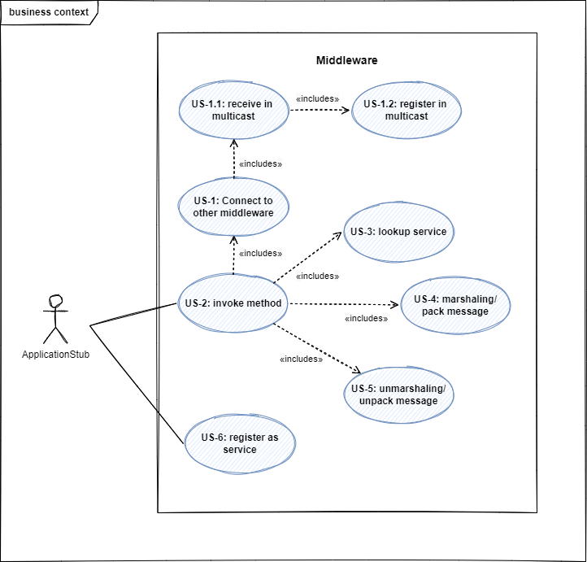
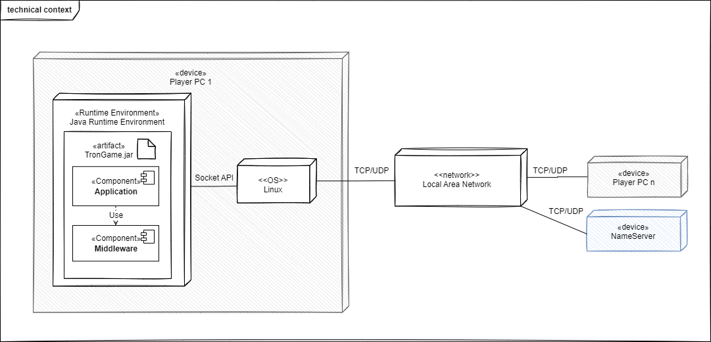

[[_TOC_]]

# 1. Einführung und Ziele

In diesem Dokument wird eine Middleware für die Applikation Tron beschrieben.

## 1.1 Aufgabenstellung

Die Middleware bildet eine Zwischenschicht zwischen der Applikation und dem Betriebssystem. Sie soll den Aufruf von Funktionen zwischen voneinander unabhängigen Nodes ermöglichen:
- Sie bietet der Applikation eine einfache Schnittstelle zum Aufrufen von Funktionen.
- Sie verpackt diese Aufrufe in Nachrichten und versendet sie über das Netzwerk.
- Sie entpackt Nachrichten aus dem Netzwerk und gibt sie an die Applikation weiter.
- Sie kommuniziert dafür mit der Middleware anderer Nodes, d.h. sie kann andere Nodes finden, ihnen Services anbieten oder ihre Services nutzen.

## 1.2 Qualitätsziele

| Ziel        | Beschreibung |
| ----------- | ----------- |
| Offenheit | Anbieten von einfachen und offenen Schnittstellen |
| Skalierbarkeit | <ul><li>Größenskalierbarkeit: Es müssen sich 2-6 Nodes beteiligen können.</li><li>Geographische Skalierbarkeit: Die Anwendung läuft in einem LAN beim Kunden (Raum 7.85 )</li><li>Administrative Skalierbarkeit: Es gibt eine administrative Domäne. </li></ul>|
| Transparenz |  <ul><li>Access: Die Applikation und die Spieler merken nicht, ob ein Methodenaufruf lokal oder remote ausgeführt wird. </li><li>Location: Weder Nutzer noch Anwendung wissen, mit welchem Computer sie sprechen (keine Eingabe von IP oder ähnliches). </li><li>Relocation: Im Betrieb nicht zu erwarten. </li><li>Migration: Für Kunden irrelevant. </li><li>Replication: Für Kunden irrelevant. </li><li>Concurrency: Für Kunden irrelevant. </li><li>Failure: Dem Entwicklerteam überlassen. </li></ul> |

## 1.3 Stakeholders

| Rolle      | Kontakt | Erwartungen
| ----------- | ----------- | ----------- |
| Dozent / Kunde | Martin Becke: martin.becke@haw-hamburg.de | Wohldefinierten Schnittstellen, Lernfortschritt der Entwickler |
| Entwickler |  Sandra: sandra.koenig@haw-hamburg.de   Inken: inken.dulige@haw-hamburg.de  Majid: majid.moussaadoyi@haw-hamburg.de | Stabile Anwendung, Anforderungen an Middleware verstehen und umsetzen |
| Spieler   | Teilnehmer des Moduls VS WiSe22/23 | Kriegt nicht mit, dass es eine Middleware gibt. |

# 2. Randbedingungen

| Technische Randbedingung        | Beschreibung |
| ----------- | ----------- |
| Java in der Version 17 | Zur Implementierung wird Java verwendet, da das ganze Team die Sprache beherrscht.   Die Version muss zum Image der Rechner im Raum 7.65 passen. Es wird Java in der Version 17 verwendet, da es sich um die neueste LTS-Version handelt.|
| Kommunikation | Die Kommunikation der Middleware erfolgt transient über RPC- und/oder ReST-Schnittstelle. |

| Konventionen | Beschreibung |
| ----------- | ----------- |
| Dokumentation | Gliederung nach dem deutschen arc42-Template, um Struktur zu wahren. |
| Sprache | Die Dokumentation erfolgt auf deutsch, während die Diagramme auf Englisch gehalten werden, um die Umsetzung in (englischen) Code zu erleichern. |

# 3. Kontextabgrenzung

## 3.1 Business Kontext

## 3.2 Technischer Kontext

# 4. Lösungsstrategie

## 4.1 Allgemein

| Lösungsstrategie | Qualitätsmerkmale | Umsetzung |
| ----------- | ----------- |----------- |
| NamingService| Transparenzziele (Access, Location) | Ein NamingService bietet allen Teilnehmern die Möglichkeit, Services zu registrieren (register), zu entfernen (unregister) und nachzuschlagen (lookup). Wegen der relativ kleinen Größenskalierung wird mit einem einzigen Naming Service geplant. |

## 4.2 Funktionale Zerlegung anhand der Use Cases
Details siehe [Use Cases](#use-cases).

| UC | Funktion                                                                         | Objekt |Vorbedingung | Nachbedingung |Ablaufsemantik|Fehlersemantik|
| ---- |----------------------------------------------------------------------------------| ----------- |----------- |----------- |----------- |----------- |
| - | - | - | - | - | - | - |

# 5. Bausteinsicht

# 6. Laufzeitsicht

# 7. Verteilungssicht

# 8. Querschnittliche Konzepte

# 9. Architekturentscheidungen

# 10. Qualitätsanforderungen

# 11. Risiken und technische Schulden

# 12. Glossar

# 13. Anhang
## Use Cases

**UC-5: **

Akteur: Applikationstub 
Ziel: Eine Methode remote ausführen
Auslöser: Ein Methodenaufruf auf einem Caller Objekt.
Vorbedingungen: 
Nachbedingungen: Methodenaufruf wurde ans Netzwerk weitergereicht.

Standardfall:

    1. Das Caller Objekt im Applikationstub ruft auf der Middleware die invoke-Methode auf und übergibt dieser den Methodenaufruf (TODO: Form).
    2. Der Marshaller nimmt den Methodenaufruf entgegen.
    3. UC-3: Marshalling durchführen.
    4. UC-2: lookup service durchführen.
    5. UC-5: send over network durchführen.
    6. 

Fehlerfall:
    2.a 

 

**UC-2: Lookup Service**

Akteur: 
Ziel: 
Auslöser: 
Vorbedingungen:
Nachbedingungen:

Standardfall:

    1. 

Fehlerfall:
    2.a 

 

**UC-3: Marshalling/Pack Message**

Akteur: 
Ziel: 
Auslöser: 
Vorbedingungen:
Nachbedingungen:

Standardfall:

    1. 

Fehlerfall:
    2.a 

 

**UC-4: Unmarshalling/Unpack Message**

Akteur: 
Ziel: 
Auslöser: 
Vorbedingungen:
Nachbedingungen:

Standardfall:

    1. 

Fehlerfall:
    2.a 

 

**UC-5: Communicate Over Network**

Akteur: 
Ziel: 
Auslöser: 
Vorbedingungen:
Nachbedingungen:

Standardfall:

    1. 

Fehlerfall:
    2.a 

 

**UC-6: Register as Service** //TODO: Wann registern wir? Wer als HOST, wer als PLAYER? Ist jeder HOST und PLAYER? Flag? Ein Host? Was ist dann mit einem zweiten Spiel?

Akteur: Applikation-Stub \
Ziel: Der Applikations-Stub ist beim NamingService registriert.\
Auslöser: Klicken des Start Button. (Mit erstem invoke)\
Vorbedingungen: Die Applikation wurde gestartet und der NamingService wurde gestartet.\
Nachbedingungen: Der Applikations-Stub ist beim NamingService unter einer ID aufzufinden und der ApplikationStub kennt seine ID.\

Standardfall:

    1. Das System holt sich aus der Config die IP und den Port des NamingService.
    2. Das System öffnet einen TCP-Socket mit der IP und dem Port.
    3. Das System schickt eine Registrierungsnachricht mit der ServiceNameId (HOST, PLAYER -> "ich bin ein Host") und seiner Adresse. 
    4. Der NamingService erhält die Nachricht und erstellt eine Id. 
    5. Der NamingService speichert den Service mit Id und Adresse.
    6. Der NamingService schickt die im NamingService erstellte Id zurück.
    7. Das System merkt sich seine Id.

Fehlerfall:
    4.a Die Nachricht ist falsch kodiert. 
        4.a.1 Der NamingService verwirft die Nachricht.

 

**UC-7: Unregister as Service**//TODO: Wann unregistern wir uns? Unregistern wir uns überhaupt?

Akteur: Appliaktion-Stub \
Ziel: Der Applikations-Stub ist nicht mehr beim NamingService registriert.
Auslöser: 
Vorbedingungen: Der Applikation-Stub wurde bereits beim NamingService registriert.
Nachbedingungen: Der ApplicationStub ist nicht mehr registriert und kann nicht mehr vom ServerStub aufgerufen werden.

Standardfall:

    1. 

Fehlerfall:
    2.a Das Service-Objekt mit der Id exisitert nicht.

 

**UC-8: Call Remote Object **

Akteur: ServerStub \
Ziel: Nachricht in Methode umwandeln
Auslöser: Nachrichtenempfang im ServerStub
Vorbedingungen: ServerStub wurde erstellt. ServerStub kann Nachrichten empfangen. Remote-Object muss registriert sein.
Nachbedingungen: Methode wird aufgerufen auf Remote Object.

Standardfall:

    1. System führt UC-4: unmarshaling durch.
    2. System sucht im Remote-Object-Register nach dem aufzurufenden Remote Object (mittels ID).
    3. System übergibt dem Remote-Object alle nötigen Informationen für den Methodenaufruf.
    4. Das Remote-Object ruft die Methode auf.

Fehlerfall:
    2.a Remote-Object mit der ID gibt es nicht im Register.
        2.a.1 Das System ignoriert die Nachricht.

 

**UC-9: Register Remote Object **

Akteur: ApplicationStub-Remote-Objekt \
Ziel: Vom ServerStub aufgerufen werden können.
Auslöser: Start der Applikation als NETWORK-Game \
Vorbedingungen: ServerStub wurde erstellt. \
Nachbedingungen: Der ServerStub merkt sich das Remote Objekt mit ID (ENUM)

Standardfall:

    1. Das System erstellt ein Remote Object.
    2. Das System registriert das Remote Object beim ServerStub.
    3. Der System speichert das RemoteObject mit ID im ServerStub.

 

