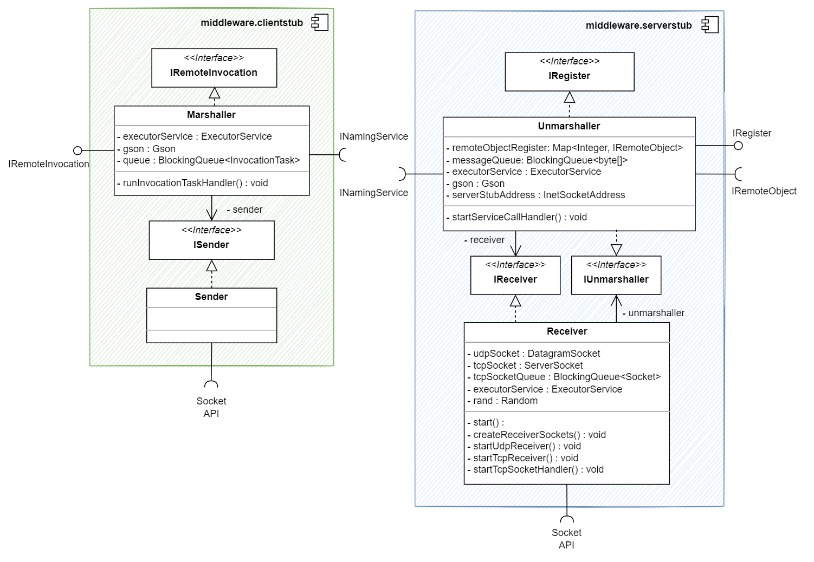
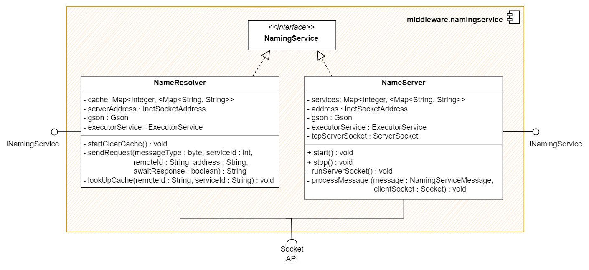
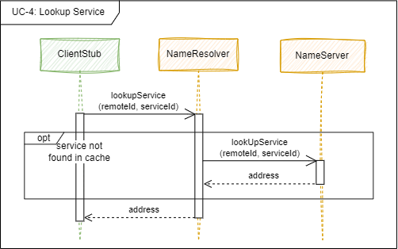
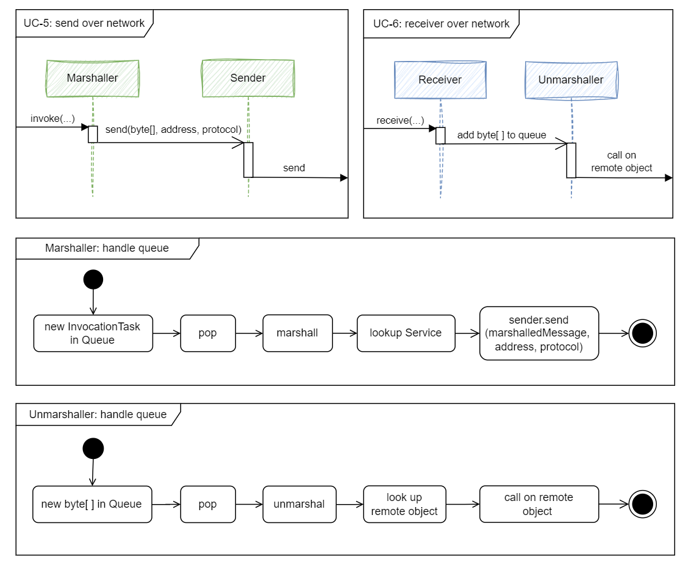

[[_TOC_]]

# 1. Einführung und Ziele

In diesem Dokument wird der Entwurf eine Middleware mit Remote Method Invocation (RMI) beschrieben.

## 1.1 Aufgabenstellung

Die Middleware bildet eine Zwischenschicht zwischen der Applikation und dem Betriebssystem. Sie soll den Aufruf von
Funktionen zwischen voneinander unabhängigen Nodes ermöglichen:

- Sie bietet der Applikation eine einfache Schnittstelle zum Aufrufen von Funktionen.
- Sie verpackt diese Aufrufe in Nachrichten und versendet sie über das Netzwerk.
- Sie entpackt Nachrichten aus dem Netzwerk und gibt sie an die Applikation weiter.
- Sie kommuniziert dafür mit der Middleware anderer Nodes, d.h. sie kann andere Nodes finden und mit ihnen kommunizieren.

## 1.2 Qualitätsziele

| Ziel        | Beschreibung |
| ----------- | ----------- |
| Offenheit | Anbieten von einfachen und offenen Schnittstellen |
| Skalierbarkeit | <ul><li>Größenskalierbarkeit: Es müssen sich 2-6 Nodes beteiligen können.</li><li>Geographische Skalierbarkeit: Die Anwendung läuft in einem LAN beim Kunden (Raum 7.85 )</li><li>Administrative Skalierbarkeit: Es gibt eine administrative Domäne. </li></ul>|
| Transparenz |  <ul><li>Access: Die Applikation und die Spieler merken nicht, ob ein Methodenaufruf lokal oder remote ausgeführt wird. </li><li>Location: Weder Nutzer noch Anwendung wissen, mit welchem Computer sie sprechen (keine Eingabe von IP oder ähnliches). </li><li>Relocation: Im Betrieb nicht zu erwarten. </li><li>Migration: Für Kunden irrelevant. </li><li>Replication: Für Kunden irrelevant. </li><li>Concurrency: Für Kunden irrelevant. </li><li>Failure: Dem Entwicklerteam überlassen. </li></ul> |

## 1.3 Stakeholders

| Rolle      | Kontakt | Erwartungen
| ----------- | ----------- | ----------- |
| Dozent / Kunde | Martin Becke: martin.becke@haw-hamburg.de | Wohldefinierten Schnittstellen, Lernfortschritt der Entwickler |
| Entwickler |  Sandra: sandra.koenig@haw-hamburg.de <br/> Inken: inken.dulige@haw-hamburg.de<br/> Majid: majid.moussaadoyi@haw-hamburg.de | Stabile Anwendung, Anforderungen an Middleware verstehen und umsetzen |
| Spieler   | Teilnehmer des Moduls VS WiSe22/23 | Kriegt nicht mit, dass es eine Middleware gibt. |

# 2. Randbedingungen

| Technische Randbedingung        | Beschreibung                                                                                                                                                                                                                                  |
| ----------- |-----------------------------------------------------------------------------------------------------------------------------------------------------------------------------------------------------------------------------------------------|
| Java in der Version 17 | Zur Implementierung wird Java verwendet, da das ganze Team die Sprache beherrscht. <br/> Die Version muss zum Image der Rechner im Raum 7.65 passen. Es wird Java in der Version 17 verwendet, da es sich um die neueste LTS-Version handelt. |
| Kommunikation | Die Kommunikation der Middleware erfolgt transient über RMI.                                                                                                                                                                                  |
| MTU | Es kann sich auf eine MTU von 1500 Byte verlassen werden.                                                                                                                                                                                     |

| Konventionen | Beschreibung |
| ----------- | ----------- |
| Dokumentation | Gliederung nach dem deutschen arc42-Template, um Struktur zu wahren. |
| Sprache | Die Dokumentation erfolgt auf deutsch, während die Diagramme auf Englisch gehalten werden, um die Umsetzung in (englischen) Code zu erleichern. |

# 3. Kontextabgrenzung

## 3.1 Business Kontext


## 3.2 Technischer Kontext


# 4. Lösungsstrategie

## 4.1 Allgemein

| Lösungsstrategie | Qualitätsmerkmale | Umsetzung                                                                                                                                                                                                                                        |
| ----------- | ----------- |--------------------------------------------------------------------------------------------------------------------------------------------------------------------------------------------------------------------------------------------------|
| NamingService| Transparenzziele (Access, Location) | Ein NamingService bietet allen Teilnehmern die Möglichkeit, Services zu registrieren (register), zu entfernen (unregister) und nachzuschlagen (lookup). Wegen der relativ kleinen Größenskalierung wird mit einem einzigen Name Server geplant.  |

## 4.2 Funktionale Zerlegung anhand der Use Cases

Aus den [Use Cases](#3.1-business-kontext) ergeben sich folgende benötigte Objekte, denen in folgenden Abschnitten Funktionen zugeordnet werden.

| Objekt                                | Erklärung                                                                                                           |
|---------------------------------------|---------------------------------------------------------------------------------------------------------------------|
| IRemoteInvocation (ClientStub)        | Ermöglicht den Aufruf von Services über die Middleware.                                                             |
| InvocationType {RELIABLE, UNRELIABLE} | Stellt die Art der Invocation dar und wird von IRemoteInvocation definiert.                                         |
| Marshaller (ClientStub)               | Nimmt Invoke-Aufrufe entgegem und verpackt sie in Nachrichten. Führt LookUps am NamingService durch.                |
| ISender (ClientStub)                  | Nimmt Nachrichten vom Marshaller entgegen und schickt sie ins Netzwerk.                                             |
| Protocol {TCP, UDP}                   | Stellt den zu verwendenden Protocol-Typen dar und wird vom ISender definiert.                                       |
| IReceiver (ServerStub)                | Lauscht auf einem Port und nimmt Nachrichten entgegen, die an den Unmarshaller weitergereicht werden.               |
| IUnmarshaller (ServerStub)            | Nimmt Nachrichten entgegen und entpackt sie zu MethodCalls. Kennt Remote Objekte und ruft MethodCall auf ihnen auf. |
| IRemoteObject                         | Remote Objekte können einen Service ausführen. Sie sind dem Unmarshaller bekannt.                                   |
| IRegister                             | Ermöglicht das registrieren von Remote Objekten in der Middleware.                                                  |
| INamingService                        | Verwaltet Namen und dazugehörige Adressen. Ermöglicht Registrierung und LookUp von Services.                        |
| NameResolver                          | Realisiert die Namensauflösung (LookUp)                                                                             |
| NameServer                            | Bietet ein zentrales Register für Services an, die nachgeschlagen werden können.                                    |

### 4.2.1 IRemoteInvocation

| UC | Funktion                                                                         | Objekt |Vorbedingung | Nachbedingung |Ablaufsemantik|Fehlersemantik|
| ---- |----------------------------------------------------------------------------------| ----------- |----------- |----------- |----------- |----------- |

### 4.2.2 Marshaller

| UC | Funktion                                                                         | Objekt |Vorbedingung | Nachbedingung |Ablaufsemantik|Fehlersemantik|
| ---- |----------------------------------------------------------------------------------| ----------- |----------- |----------- |----------- |----------- |

### 4.2.3 ISender

| UC | Funktion                                                                         | Objekt |Vorbedingung | Nachbedingung |Ablaufsemantik|Fehlersemantik|
| ---- |----------------------------------------------------------------------------------| ----------- |----------- |----------- |----------- |----------- |

### 4.2.4 IReceiver & Receiver
| UC | Funktion                                                                         | Objekt |Vorbedingung | Nachbedingung |Ablaufsemantik|Fehlersemantik|
| ---- |----------------------------------------------------------------------------------| ----------- |----------- |----------- |----------- |----------- |

### 4.2.5 IUnmarshaller & Unmarshaller

| UC | Funktion                                                                         | Objekt |Vorbedingung | Nachbedingung |Ablaufsemantik|Fehlersemantik|
| ---- |----------------------------------------------------------------------------------| ----------- |----------- |----------- |----------- |----------- |

### 4.2.6 IRemoteObject

| UC | Funktion                                                                         | Objekt |Vorbedingung | Nachbedingung |Ablaufsemantik|Fehlersemantik|
| ---- |----------------------------------------------------------------------------------| ----------- |----------- |----------- |----------- |----------- |

### 4.2.6 IRegister

| UC | Funktion                                                                         | Objekt |Vorbedingung | Nachbedingung |Ablaufsemantik|Fehlersemantik|
| ---- |----------------------------------------------------------------------------------| ----------- |----------- |----------- |----------- |----------- |

### 4.2.6 INamingService, NameResolver, NameServer

| UC | Funktion                                                                         | Objekt |Vorbedingung | Nachbedingung |Ablaufsemantik|Fehlersemantik|
| ---- |----------------------------------------------------------------------------------| ----------- |----------- |----------- |----------- |----------- |


| UC | Funktion                                                                         | Objekt |Vorbedingung | Nachbedingung |Ablaufsemantik|Fehlersemantik|
| ---- |----------------------------------------------------------------------------------| ----------- |----------- |----------- |----------- |----------- |
| UC-1 | registerRemoteObject(serviceId: int, remoteObject : IRemoteObject) : void | Unmarshaller(ServerStub) | ServerStub wurde erstellt | Der ServerStub merkt sich das Remote Objekt mit der Service ID | Registeriert ein Remote Object beim ServerStub, damit es von diesem aufgerufen werden kann. | - |
| UC-2 | invoke(remoteId: String, serviceId: int, parameters: int... (varargs), type: InvocationType) : void | IRemoteInvocation(ClientStub) | ClientStub wurde erstellt | Die Methode wird durch ein Remote-Object ausgeführt (Callee) | Ruft eine Methode auf einem einem Remote-Object auf (UC-3, UC-4, UC-5, UC-6, UC-7 und UC-8.) | - | 
| UC-3 | lookUpService(remoteId: long, serviceId: int) : Service | INamingService | NamingServer muss laufen | Der ClientStub kennt die Informationen des Services (IP:Port, remoteId) | Gibt die Adresse und Id eines Services zurück. | - |
| UC-4 | marshal(invocation: MethodCall) : byte[] | Marshaller | - | Die Nachricht wurde verpackt | Der MethodCall wird in eine versendbare Nachricht verpackt. | - | 
| UC-5 | send(message: byte[], address: InetAddress, protocol: Protocol) : void | ISender(ClientStub) | Der Adressat ist bekannt | Methodenaufruf wurde ans Netzwerk weitergereicht | Der Sender öffnet einen Socket an den angebenen Adressaten und schickt die Nachricht über den Socket. | Wenn der Adressat nicht bekannt ist, wird die Nachricht verworfen. | - |
| UC-7 | unmarshal(message : byte[]) : MethodCall | Unmarshaller | - | Die Nachricht wurde zu einem MethodCall entpackt. | Die angekommene Nachricht wird entpackt. | - | 
| UC-8 | lookUpRemoteObject(serviceId: int) : IRemoteObject | Unmarshaller | Das gesuchte Remote Object ist registriert | - | Sucht ein Remote Object anhand der Id des Services, den es anbietet. | - |
| UC-8 | call(serviceId, parameters: int...(varargs)) : void | IRemoteObject | Remote-Object muss registriert sein | Methode wurde vom Remote Object ausgeführt | Ein MethodCall wird auf einem Remote Object aufgerufen. | Sind die Parameter fehlerhaft oder die Service ID unbekannt, bricht das Remote-Object den Aufruf ab. | - |
| UC-9 | registerService(remoteID: String, serviceId: int, address: InetAddress) : void | INamingService | Die Applikation wurde gestartet und der NameServer ist erreichbar. NameResolver kennt NameServer (Config) | Service ist beim NamingService unter remoteId und ServiceId aufzufinden | Ein Service wird beim Naming Service mit seiner remoteId und Id des angebotenen Service registriert.| Fehlerhafte Registrierungsanfragen werden verworfen. | - |
| UC-10 | unregisterService(remoteID: String) : void | INamingService | Der NameServer ist erreichbar | Die Services mit der übergebenen remoteId ist nicht mehr registriert | Die Services mit der übergebenen remoteID werden aus dem Naming Service entfernt. | Fehlerhafte Abmeldungsanfragen werden verworfen. | 

# 5. Bausteinsicht

## Ebene 1:


## Ebene 2:




Darüber hinaus werden im Diagramm nicht ausmodellierte Records für die Erleichterung des Datenaustausches verwendet: 

| Record                 | package               | verwendet von            | Beschreibung                                                                                                                             |
|------------------------|-----------------------|--------------------------|------------------------------------------------------------------------------------------------------------------------------------------|
| `InvocationTask`       | middleware.clientstub | Marshaller               | Stellt einen invoke-Aufruf als Objekt dar, damit es in einer Queue gespeichert werden kann.                                              |
| `ServiceCall`          | middleware            | Marshaller, Unmarshaller | Stellt den Aufruf eines Services als Objekt dar und ist in [Remote Method Invocation](#8.1.1-Remote-Method-Invocation) näher beschrieben |
| `NamingServiceMessage` | namingservice         | NameResolver, NameServer | Dient dem Datenaustausch zwischen Resolver und Server und ist in [Naming Service](#8.1.2-NamingService) näher beschrieben.               |

# 6. Laufzeitsicht





# 7. Verteilungssicht

# 8. Querschnittliche Konzepte

## 8.1 Nachrichtenaustausch

### 8.1.1 Remote Method Invocation

Die Middleware bietet über ihre Schnittstellen Remote Method Invocation an, d.h. es können Services auf Remote Objekten
aufgerufen werden.
Ein solcher `ServiceCall` wird im JSON-Format kodiert. Ein Beispiel dafür:

```json
{
  "serviceId": 1,
  "intParameters": [
    0,
    1
  ],
  "stringParameters": [
    "4c3e90e6-9ec6-4a86-88cb-5e05311f8927",
    "4c3e90e6-9ec6-4a86-88cb-5e05311f8927"
  ]
}
``` 

### 8.1.2 NamingService

Der NamingService verwendet in JSON kodierte Nachrichten. Ein Beispiel für eine solche `NamingServiceMessage`: 

```json
{
  "messageType": 1,
  "serviceId": 0,
  "remoteId": "3d46fa0c-0c8e-4555-ad7c-6e31d11920fd",
  "address": "25.35.92.196:36648"
}
``` 
Dabei bezeichnet messageType die Art der Nachricht: 

| Nachrichtentyp  | messageType | serviceId                   | remoteId                                                    | address                      |
|-----------------|-------------|-----------------------------|-------------------------------------------------------------|------------------------------|
| `REGISTER`      | 1           | ID des angebotenen Services | remoteId des Serviceanbieters                               | Adresse des Serviceanbieters |
| `UNREGISTER`    | 2           | NO_SERVICE                  | remodeId, die aus dem NamingService entfernt werden soll    | NO_ADDRESS                   |
| `LOOKUP`        | 3           | ID des gesuchten Services   | remoteId des gewünschten Serviceanbieters oder NO_REMOTE_ID | NO_ADDRESS                   |
| `RESPONSE`      | 4           | NO_SERVICE                  | NO_REMOTE_ID                                                | Adresse des Serviceanbieters |


## 8.2 Identifier

Es wird ein hierarchischer Namensraum verwendet. Jeder Service trägt eine ID (serviceId). Jeder Service kann von
mehreren Remote Objekten angeboten werden. Diese werden anhand ihrer remoteId identifiziert.
Zur Namensauflösung wird ein zentraler Name Server verwendet, dessen Adresse allen Nodes bekannt sein muss.

# 9. Architekturentscheidungen

# 10. Qualitätsanforderungen

# 11. Risiken und technische Schulden

# 12. Glossar

# 13. Anhang

## Use Cases

**UC-1: Register Remote Object**

**Akteur**: ApplicationStub-Remote-Objekt \
**Ziel**: Vom ServerStub aufgerufen werden können. \
**Auslöser**: Start der Applikation als NETWORK-Game \
**Vorbedingungen**: ServerStub wurde erstellt. \
**Nachbedingungen**: Der ServerStub merkt sich das Remote Objekt mit aufrufbaren Methoden (Ordinal des ENUM, zB: 1 =
DRAW, 2 = REGISTER).

**Standardfall**:

    1. Das System erstellt ein Remote Object.
    2. Das System registriert das Remote Object beim ServerStub mit den ServiceIds der Services, die es anbietet.
    3. Das System speichert das RemoteObject mit den ServiceIds im ServerStub.

<br/>


**UC-2: Invoke Method**

**Akteur**: ApplicationStub-Caller \
**Ziel**: Eine Methode remote ausführen.\
**Auslöser**: Aufruf von invoke(...) durch Caller-Objekt \
**Vorbedingungen**: ClientStub wurde erstellt. NameServer läuft. \
**Nachbedingungen**: Die Methode wird durch ein Remote-Object ausgeführt (Callee).

**Standardfall**:

    1. ApplicationStub-Caller ruft die invoke(...) Methode der Middleware 
       mit der remoteId, der serviceId, den Parametern und dem InvocationType auf.
    2. Der ClientStub verpackt den Methodenaufruf in eine Nachricht (UC-4: Marshalling).
    3. Der ClientStub übersetzt den InvocationType aus der invoke-Methode in das zu verwendene Protokoll.
    4. Der ClientStub führt einen Lookup nach der RemoteId und ServiceId durch (UC-3: Lookup Service).
    5. Der ClientStub versendet die Nachricht aus dem Marshalling an den Service aus Schritt 4 
       und dem Protokoll aus Schritt 3 (UC-5: Send over Network).
    6. Der angesprochene ServerStub erhält die Nachricht und liest sie aus (UC-6: Receive over Network)
    7. Der ServerStub entpackt die Nachricht (UC-7: Unmarshalling)
    8. Der ServerStub sucht in seiner Liste nach dem angesprochenen Remote Object
    9. Der ServerStub führt einen MethodenCall auf dem angesprochenen Remote Object durch (US-8: Call Remote Object)

<br/>

**UC-3: Marshalling/Pack Message**

**Akteur**: Marshaller (ClientStub)\
**Ziel**: Methodenaufruf in Nachricht verpacken\
**Auslöser**: invoke(...) wurde von einem Caller-Objekt des ApplicationStubs aufgerufen\
**Vorbedingungen**: Der Adressat ist bekannt.\
**Nachbedingungen**: Die Nachricht wurde dem Sender übergeben.

**Standardfall**:

    1. Der Marshaller verpackt die Informationen der invoke(...) Methode in einen ServiceCall.
    2. Der Marshaller verpackt den MethodCall ins JSON-Format.
    3. Der Marshaller erzeugt aus dem JSON ein byte-Array.

<br/>


**UC-4: Lookup Service**

**Akteur**: Marshaller (ClientStub)\
**Ziel**: Adresse des gesuchten Services herausfinden\
**Auslöser**: invoke(CalleeID, Methodenname, Parameterliste) wurde von einem Caller-Objekt des ApplicationStubs
aufgerufen\
**Vorbedingungen**: NamingServer muss laufen. \
**Nachbedingungen**: Der ClientStub kennt die Informationen des Services (IP:Port, CalleeID).

**Standardfall**:

    1. Der Marshaller führt einen LookUp bei seinem lokalen NameResolver durch 
       mit den Parametern RemoteId und ServiceId des invoke(...) Aufrufs.
    2. Der NameResolver sendet eine LookUp-Anfrage an den zentralen NameServer mit den gleichen Daten.
    3. Der NamingServer sucht in seiner Tabelle nach dem angefragten Service.
    4. Der NamingServer antwortet mit Adresse des Services.
    5. Der NameResolver merkt sich den Service in seinem Cache.
    6. Der NameResolver gibt dem Marshaller die Informationen über den Service zurück. 

**Erweiterungsfall**:

    2.a Der NameResolver findet den gewünschten Service in seinem Cache.
    2.a.1 Weiter in Schritt 6 des Standardfalls.

<br/>


**UC-5: Send over Network**

**Akteur**: Sender (ClientStub)\
**Ziel**: Nachricht über das Netzwerk schicken.\
**Auslöser**: Der Marshaller hat eine Nachricht verpackt und dem Sender übergeben\
**Vorbedingungen**: Der Adressat ist bekannt.\
**Nachbedingungen**: Nachricht wurde ans Netzwerk weitergereicht.

**Standardfall**:

    1. Der Sender öffnet einen Socket an den angebenen Adressaten mit dem übergebenen Protokoll.
    2. Der Sender schickt die Nachricht über den Socket.

**Fehlerfall**:

    2.a Der angegebene Adressat ist nicht erreichbar.
    2.a.1 Der Methodenaufruf wird verworfen. 

<br/>


**UC-6: Receive over Network**

**Akteur**: Receiver (ServerStub) \
**Ziel**: Nachricht verarbeiten. \
**Auslöser**: Es kommt eine Nachricht rein. \
**Vorbedingungen**: Receiver lauscht auf Nachrichten.\
**Nachbedingungen**: Receiver hat die Nachricht weitergegeben zum Verarbeiten. Der Receiver befindet sich wieder im
listen-Status.

**Standardfall**:

    1. Der Receiver liest die Nachricht vom Socket.
    2. Der Receiver übergibt die ausgelesene Nachricht dem Unmarshaller.
    3. Der Receiver kehrt in den listen-Status zurück.

<br/>

**UC-7: Unmarshalling/Unpack Message**

**Akteur**: Unmarshaller (ServerStub) \
**Ziel**: Nachricht in Methodenaufruf umwandeln \
**Auslöser**: Unmarshaller erhält eine Nachricht vom Receiver \
**Vorbedingungen**: Der Receiver lauscht auf Nachrichten.
**Nachbedingungen**: UC-8 wird ausgeführt

**Standardfall**:

    1. Der Unmarshaller entpackt die Nachricht vom Receiver in serviceId und Parameter.
    2. UC-2: Call Remote Object durchführen.

<br/>


**UC-8: Call Remote Object**

**Akteur**: Unmarshaller (ServerStub) \
**Ziel**: Methode aufrufen \
**Auslöser**: UC-7 wurde durchgeführt. \
**Vorbedingungen**: Remote-Object muss registriert sein. \
**Nachbedingungen**: Methode wird aufgerufen auf Remote Object.

**Standardfall**:

    1. Unmarshaller sucht im Remote-Object-Register nach dem aufzurufenden Remote Object mit der gesuchten serviceId.
    2. Unmarshaller übergibt dem Remote-Object alle nötigen Informationen für den Methodenaufruf.
    3. Das Remote-Object ruft die Methode auf.

**Fehlerfall**:

    2.a Remote-Object mit der serviceId gibt es nicht im Register.
        2.a.1 Der Unmarshaller verwirft die Nachricht.
    3.a Die Parameter (z.B. serviceId unbekannt) sind fehlerhaft.
        2.a.1 Das Remote-Object bricht den Aufruf ab.

<br/>

**UC-9: Register as Service**

**Akteur**: ServerStub \
**Ziel**: Das Remote Objekt sind beim NamingService registriert.\
**Auslöser**: Remote Objekt registriert sich beim ServerStub. \
**Vorbedingungen**: Die Applikation wurde gestartet und der NameServer wurde gestartet. NameResolver kennt NameServer (
Config).\
**Nachbedingungen**: Das Remote Objekt ist beim NamingService unter seiner remoteId und serviceId aufzufinden

**Standardfall**:

    1. Der ServerStub schickt einen Registrierungsaufruf an den lokalen NameResolver.
    2. Der NameResolver öffnet einen TCP-Socket mit der IP und dem Port zum NameServer.
    3. Der NameResolver schickt eine Registrierungsnachricht mit der serviceId (Ordinal des Enums der angebotenen Methode),
       seiner remoteID und der Adresse des ServerStubs.
    4. Der NameServer erhält die Nachricht.
    5. Der NameServer speichert den Service mit serviceId, remoteId und Adresse des ServerStubs.

**Fehlerfall**:

    4.a Die Nachricht ist falsch kodiert.
        4.a.1 Der NameServer verwirft die Nachricht.

<br/>


**UC-10: Unregister as Service**

**Akteur**: ServerStub \
**Ziel**: Die Remote Objekte sind nicht mehr beim NamingService registriert.\
**Auslöser**: Die Applikation wird geschlossen. \
**Vorbedingungen**: Der NameServer ist erreichbar. \
**Nachbedingungen**: Die Remote Objekte des ServerStubs sind nicht mehr registriert.

**Standardfall**:

    1. Der ServerStub schickt einen unregister-Aufruf an den lokalen NameResolver.
    2. Der NameResolver öffnet einen TCP-Socket mit der IP und dem Port zum NameServer.
    3. Der NameResolver schickt eine Abmeldungsnachricht mit der RemoteID an den NameServer.
    4. Der NameServer erhält die Nachricht.
    5. Der NameServer entfernt alle Services mit der RemoteID aus seiner Tabelle.

**Fehlerfall**:

    5.a Die Nachricht ist falsch kodiert.
        5.a.1 Der NameServer verwirft die Nachricht.

<br/>


