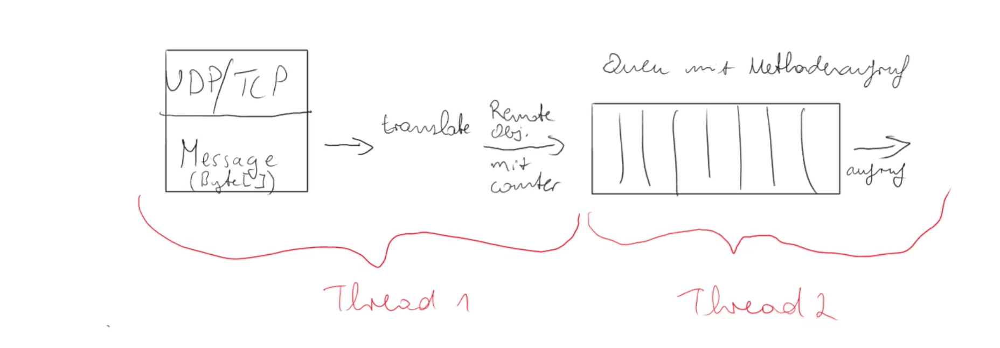

### Anmerkungen Sandra
- Activity Diagramme: 
    - Detect Collision nach Martin feedback bisschen angepasst -> mal drüber gucken, was euch besser passt / was mehr Sinn macht.
    -> sieht gut aus, Kantenbeschreibung wäre nicht unbedingt notwendig -> ist besser lesbar 
    - Activity Diagram für Gameloop erstellt -> ok? Was ist besser lesbar, Activity oder Sequenz?
    -> pfeil beschriftung player not alive irritierend, ansonsten activitätdiagram besser lesbar
- Labels: Prio Labels an den Git Issues erstellt. -> Prios ggf. anpassen, wenn ihr etwas anders seht.
- Implementierung: Extra Milestone für Implementierung der App angelegt. Due Date kurz vor Weihnachten! Jeder mal so nebenbei Issues schnappen. Feature Branches? -> ggf. über Teststrategie sprechen
- Martin zum Thema NameServer und toter Host: 
    - EGAL :'D Hautpsache *ein* Spiel läuft. Wir sollen uns das Leben nicht zu schwer machen!
    - NameResolver Cache: Normalerweise haben NameServices eine time to live. Wollen wir das auch machen? z.B. Counter an Requests, nach denen nochmal am Server gefragt wird.
    -> Gute Idee mit dem Counter am Request, wieviele Request sind sinnvoll?
- nochmal zum game.prepare ... :) Wir übergeben gerade den playerCount und den waitingTimer, NICHT arenaRows und arenaColumns
    - Remote: Arena wird vom Host bestimmt, waitingTimer aber vom ersten, der das Spiel eröffnet
    - Vorschlag: Vereinheitlichen. Der, der das Spiel eröffnet, bestimmt alles. Bitte abstimmen.
    -> Der Host hat Datenhohheit und bestimmt die länge des Timers, der erste Spieler startet doch nur den Timer (also Signal wird von dem gesetzt zum starten) mit der länge vom Host. Damit wäre es ja schon vereinheitlicht 
- zu den offenen Issues der Middleware schreibe ich noch ein paar Ideen an die Issues. 

###Fragen 
- War die Zirkularität nicht vorher schon beständigt, zwischen View und Model -> wenn nicht warum gibt es die jetzt weil Game hatte vorher doch auch eine Schnittstelle zur ITronView 
    - in wiefern kann die Zirkularität uns beeinträchtigen -> wenn nicht dann für den Vorschlag das die Game und der GameManager die View einfach kennt 

### Besprochenes:
- Über calculateFairStartingPosition gesprochen, ob man die seitenpositionen rauszulassen 
    -> ist eventuell doch nicht fair, berücksichtigen das Spieler zu Spieler gleicher Abstand und das Spieler zur Wand gleicher Abstand
- ToDo Liste (Issues) aktualisieren Issue 21
- Issue 22: Verantwortlichkeit verändert sich nicht, eine Receiver Klasse reicht um beide Bereich abzudecken 
    -> wie verhält sich das wenn beide auf dem gleichen Port lauschen? Wie können die differenziert werden? weil Nachricht ist ja erstmal ein Datagram
    - ist guter Vorschlag mit den InvocationTypes
- Issue 24: gehört am Donnerstag zum Termin
- Issue 33: 
    - Marshaller ist gute Idee 
    -> Vorschlag der Screenshot, Nachrichten eingang, übersetzung, dann in Queue, methodenaufrufe
    
