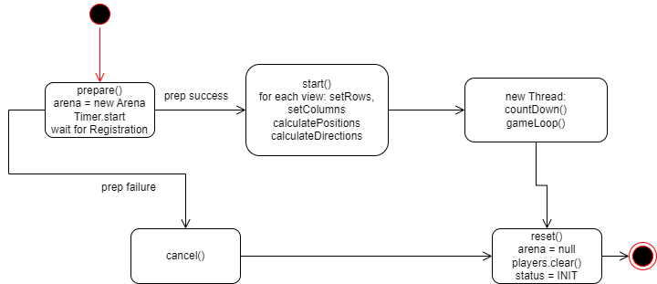

[[_TOC_]]

**Protokoll - 17.11.2022**

## Register at Game

- Anpassungen vornehmen, mehrere Views vs eine View ist beim GameManager hinterlegt. Bei game.register werden nun Player erzeugt.

    GameManager bei ButtonClick PLAY GAME:
    - game anschmeißen: game.prepare(rows, columns, waitingTimer, playercount)
    - registrieren:
            - ggf. boolean "singleView", true == local (alle player in einer View), false == remote
            - game.register(this, this.view, 1 || playercount)
            - wenn GameManager singleView == true, übergibt er playerCount (eine view für ALLE player)
            - wenn singleView == false, übergibt GM "1" -> er verwaltet einen Player.

    Game bei register:
    - add GM & view zu Observern
    - for i in 0..playerCount: new Player(i)
    - return Liste von IDs an GM
    -> GM weiß, welche PlayerIDs er verwalten muss (für KeyInputs)

    CONFIG:
    Game erhält "Referenz" auf alle VIEWs, die sich bei ihm registrieren.
    -> ggf. ITronView anpassen mit "setRow" und "setColumn" -> kann dann REMOTE auf allen agerufen werden, ohne dass Configs ausgetauscht / geändert werden müssen
    

## Register at Name Service
- erst bei Betätigung der Start Buttons -> erst dann ist man spielbereit!
- IP:Port vom NamingService in Config 
- UDP oder TCP?
    - UDP: Gefahr der Multiregistrierung & Implementierungsaufwand mit Delay und einmalige Registrierung sicherstellen
    - TCP: Verbindungsaufwand
    -> TCP 

## Java version 17 im Labor
- installiert unter /mnt/fileserver/MyHome/jdk-17.0.5/bin/java
- in Konsole verwendbar, zB: "/mnt/fileserver/MyHome/jdk-17.0.5/bin/java -version"
