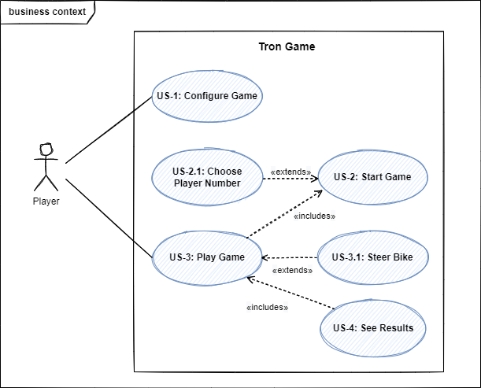
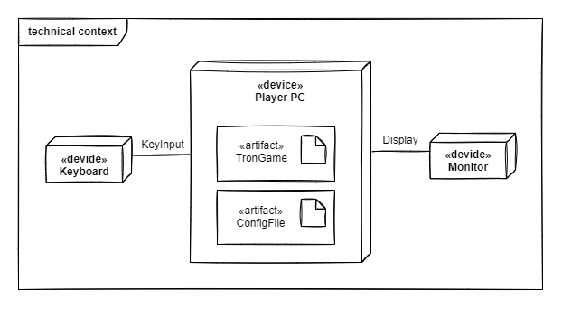
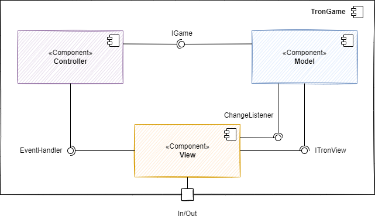
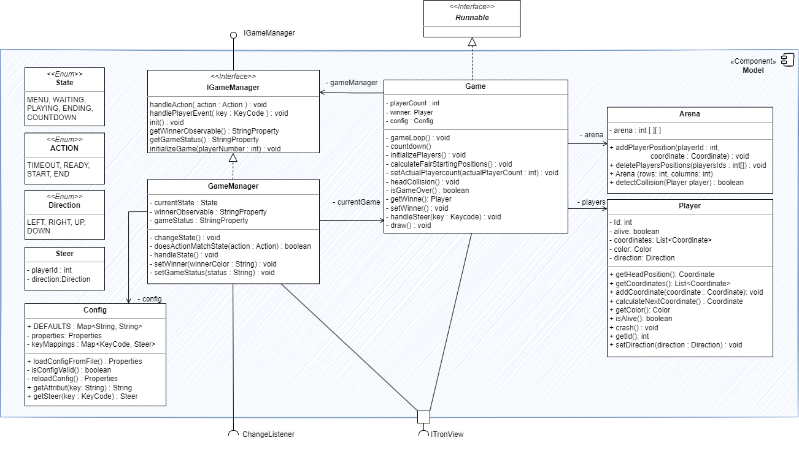
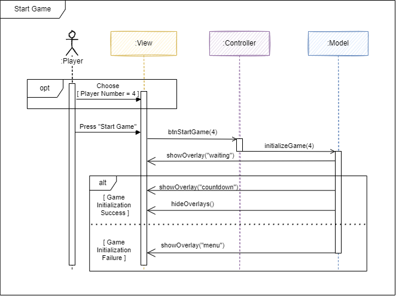
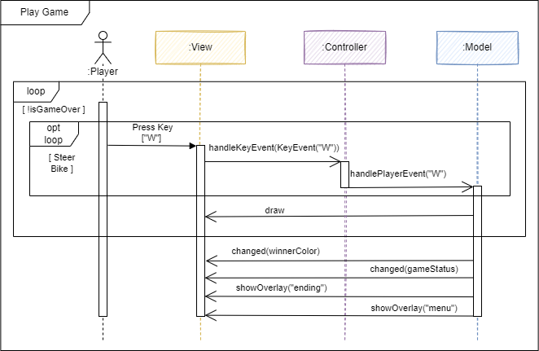
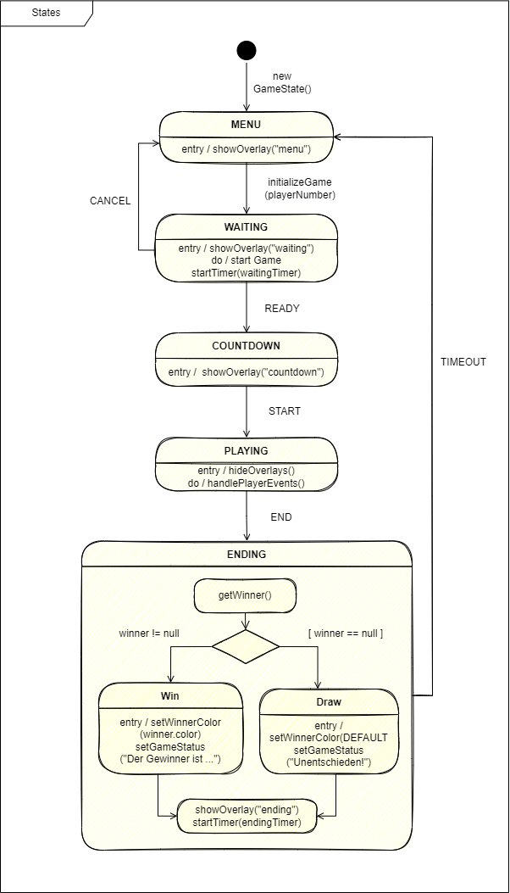
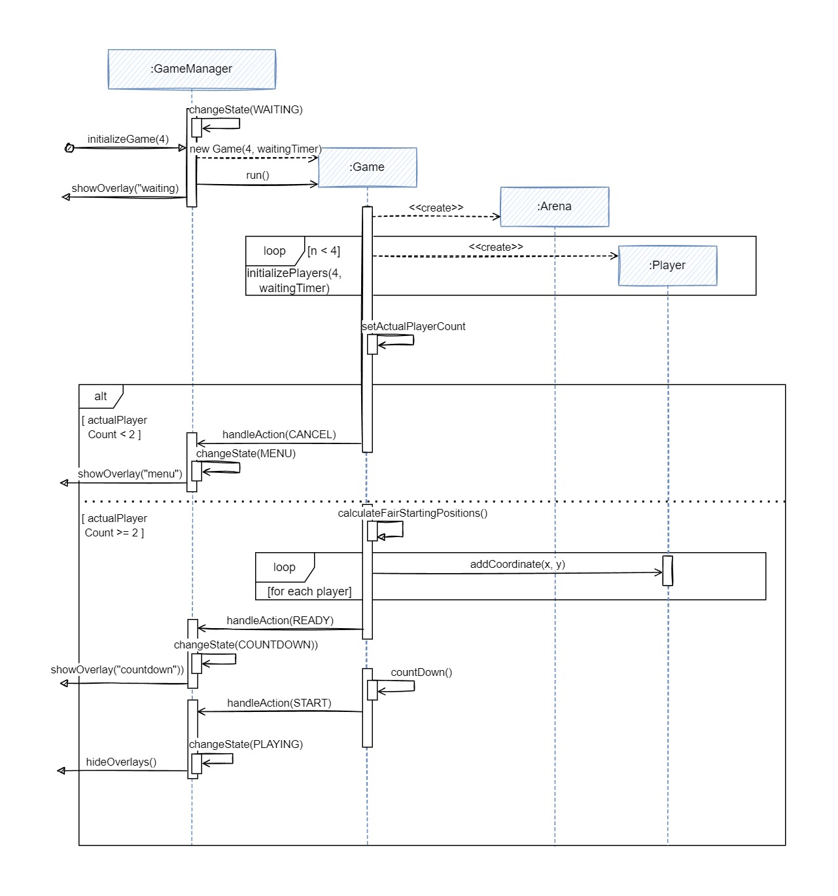
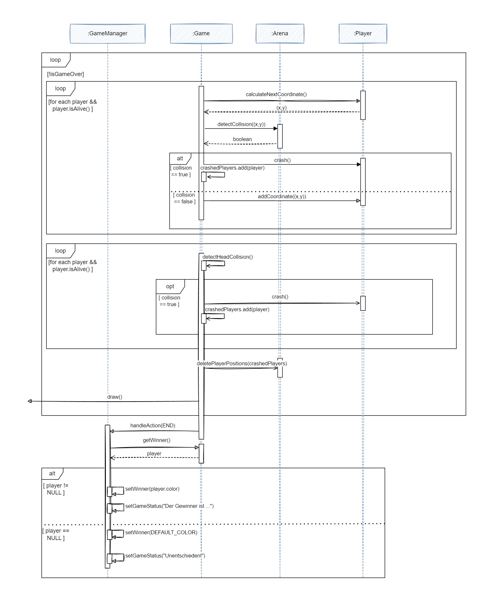
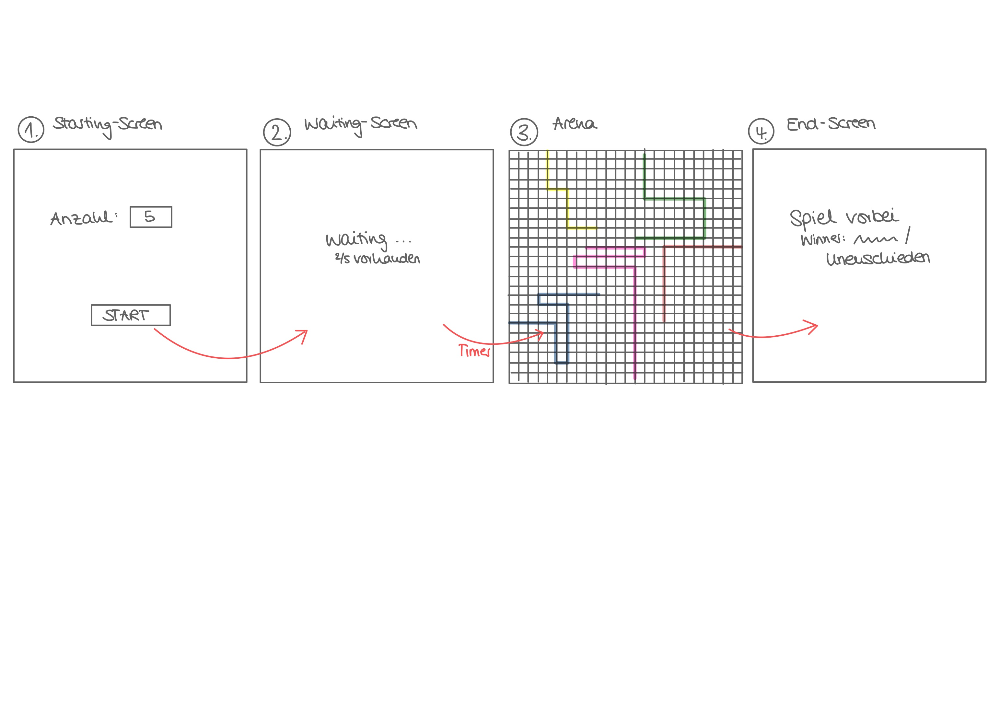

[[_TOC_]]

# 1. Einführung und Ziele

Dieses Projekt entsteht im Rahmen des Moduls “Verteilte Systeme” und hat zum Ziel, das Multiplayer-Spiel “Tron” als Standalone Applikation zu entwickeln.

## 1.1 Aufgabenstellung

Allgemeine Spielprinzipien:

- Das Spiel wird mit mehreren Spielern gespielt, die jeweils ein Motorrad in einer Arena (das Spielfeld) steuern.
- Die Motorräder bewegen sich stetig vorwärts, in einer konstanten Geschwindigkeit.
- Der Spieler kann das Motorrad nach links oder rechts steuern und sich so über das Spielfeld nach oben, unten, links, rechts bewegen.
- Die Motorräder ziehen farbige “Schatten” hinter sich auf, die für die Lebenszeit des Spielers auf dem Spielfeld bleiben und durch die Vorwärtsbewegung der Motorräder länger werden.
- Ein Spieler stirbt, wenn er gegen die Wand der Arena oder den Schatten eines anderen Spielers fährt. Treffen zwei Spieler aufeinander, sterben beide.
- Wenn ein Spieler stirbt, verschwindet sein Schatten aus der Arena und er kann nicht weiterspielen.
- Alle Spieler spielen gegeneinander. Gewonnen hat der, der am längsten überlebt. Sterben die letzten beiden Spieler gleichzeitig, ist es unentschieden.

Details siehe [Anforderungsdetails](#anforderungsdetails).

## 1.2 Qualitätsziele

| Ziel        | Beschreibung |
| ----------- | ----------- |
| Wohldefinierte Schnittstellen | Die Entwickler sollen sich gut um ihre Schnittstellen kümmern :) |
| Fehlertoleranz      | Ein Spiel soll ungestört durchspielbar sein. Auch wenn ein Teilnehmer abstürzt, läuft das Spiel weiter.       |
| Bedienbarkeit | Spieler sollen das Spiel einfach bedienen können und Spaß haben |
| Kompatibilität   | Mindestens 2 Teams müssen miteinander spielen können.        |
| Fairness | Das Spiel soll fair sein. Alle Spieler starten mit fairen Konditionen und folgen den gleichen Regeln
| Spielbarkeit | Damit das Spiel flüssig läuft, brauchen wir mindestens 18 Frames

## 1.3 Stakeholders

| Rolle      | Kontakt | Erwartungen
| ----------- | ----------- | ----------- |
| Dozent / Kunde | Martin Becke: martin.becke@haw-hamburg.de |  Saubere Architektur mit Pattern und wohldefinierten Schnittstellen, Lernfortschritt der Entwickler |
| Entwickler | Sandra: sandra.koenig@haw-hamburg.de   Inken: inken.dulige@haw-hamburg.de  Majid: majid.moussaadoyi@haw-hamburg.de| Spaß an der Entwicklung, Architekturentwurf lernen, gutes Time handling, JavaFX Kenntnisse verbessern|
| Spieler   | Teilnehmer des Moduls VS WiSe22/23 | Stabile Anwendung, Spaß am Spielen |

# 2. Randbedingungen

| Technische Randbedingung        | Beschreibung |
| ----------- | ----------- |
| Java in der Version ... | Zur Implementierung wird Java verwendet, da das ganze Team die Sprache beherrscht.   Die Version muss zum Image der Rechner im Raum 7.85 passen. |
| View Library | Es wird die zur Verfügung gestellte JavaFX View Library verwendet, um Zeit in der UI-Erstellung zu sparen. |

| Konventionen | Beschreibung |
| ----------- | ----------- |
| Dokumentation | Gliederung nach dem deutschen arc42-Template, um Struktur zu wahren. |
| Sprache | Die Dokumentation erfolgt auf deutsch, während die Diagramme auf Englisch gehalten werden, um die Umsetzung in (englischen) Code zu erleichern. |

# 3. Kontextabgrenzung

## 3.1 Business Kontext

 \
Details siehe [Use Cases](#use-cases).

## 3.2 Technischer Kontext

# 4. Lösungsstrategie

## 4.1 Allgemein

| Lösungsstrategie | Qualitätsmerkmale | Umsetzung |
| ----------- | ----------- |----------- |
| Fachliche Komponenten Trennung | Funktionalität, Wartbarkeit, Übertragbarkeit | Die Einführung vom MVC-Pattern soll die bearbeitung an der Applikation vereinfachen und der Applikation eine verständliche Struktur geben.  |
| Grenzen der Konfiguration | Stabilität | Wir wollen vermeiden, dass Spieler die Konfigurationsdatei auf eine nicht vorgesehene Art und Weise manipulieren können. Um dies zu Gewährleisten überprüfen wir die Konfigurationsdatei bei jedem Start der Tron Anwendung und erstellen im Fall einer Beschädigung eine neu.  |
| Gleichmäßige Geschwindigkeit für alle Spieler | Zuverlässigkeit | Die generelle Spielgeschwindigkeit wird über die Konfigurationsdatei festgelegt. Jeder Spieler erhält in einem "Steuerungs-Intervall" die gleiche Anzahl an Bewegungen (Eine Bewegung) welcher er machen kann. |
| Faire Steuerung | Benutzbarkeit | Jeder Spieler soll die Möglichkeit haben seine favoritisierte Steuerung in der Konfigurationsdatei zu hinterlegen. Vor jedem Match wird den Spieler die Steuerung nochmal angezeigt. Doppelte Tastenbelegungen werden zwar zugelassen, die Spieler werden aber darüber informiert und eine Anpassung der Steuerung wird empfohlen. |
| Faire konfigurierbare Steuerung | Benutzbarkeit | Jeder Spieler soll die Möglichkeit haben seine favoritisierte Steuerung in der Konfigurationsdatei zu hinterlegen. Vor jedem Match wird den Spieler die Steuerung nochmal angezeigt. Doppelte Tastenbelegungen werden zwar zugelassen, die Spieler werden aber darüber informiert und eine Anpassung der Steuerung wird empfohlen. |
| Stabilität bei Absturz anderer Teilnehmer | Stabilität | Ein Spieler, welcher als nicht mehr erreichbar identifiziert wurde, wird aus dem Spiel entfernt. Dazu gehört sein Bike, sowie der Schatten, welchen er  im laufe des Spiels gelegt hat. |

## 4.2 Funktionale Zerlegung anhand der Use Cases
### 4.2.1 Model
| UC | Funktion | Objekt |Vorbedingung | Nachbedingung |Ablaufsemantik|Fehlersemantik|
| ---- | ----------- | ----------- |----------- |----------- |----------- |----------- |
| UC-1 |loadConfig() : void| Config | Es existiert ein Config-Objekt. Es existiert eine TronConfig.properties File. | Properties-Objekt ist erzeugt. |Die Konfigurationsdatei ist ein '.properties' File, in Form: 'Key', 'Value' und wird in ein Properties-Objekt eingelesen. Das Config-Objetzt hält eine Referenz darauf.| Bei fehlender .properties-Datei an der erwarteten Speicheradresse, wird neue .properties-Datei erstellt. |
| UC-1 |isConfigValid()| Config | Es existiert ein Properties-Objekt. | Das Ergebnis ist wahr oder falsch. | Der Inhalt des Properties-Objekt wird auf fehlende 'Keys' geprüft. Und ob die 'Values' sich im richtigen Wertebereich befinden. Sollte einer der beiden Fälle eintreffen, würde die Methode 'false' zurückgeben. | - |
| UC-1 |reloadConfig() |Config | isConfigValid() == 'false'. Schreibrechte. | Properties mit 'default'-Werten erzeugt. | Es wird eine neues Properties-Objekt auf Basis vom im Programmcode festgelegten 'Key-Value-Paaren' in der Config erstellt. Das Properties-Objekt wird auch an der hinterlegten Speicheradresse lokal  in Form einer .properties-Datei hinterlegt.  | Wenn kein Zugriff auf den lokalen Speicher besteht, wird der Anwender darüber informiert. |
| UC-1|setKeyMappings() : void| Config | Es existiert ein Properties-Objekt mit validen Daten | In dem Config-Objekt existiert eine Map, welche als 'Key' alle Tasten enthält, welche zum lenken genutz werden können. Als Value erhält die Map ein Steer-Objekt welches die Player-ID, sowie die Direction hält. | Die Methode zieht sich aus dem properties-Objekt die tastenbelegungen aller Spieler. | - |
| UC-1 |getAttribute(key : String) : String| Config | Es existiert ein Properties-Objekt mit validen Daten. | Es wurde der passende 'Value' zum 'Key' zurückgegeben.| Die Methode greift auf ein Properties-Objekt zu und zieht sich den ersten 'Value' welcher zu dem Eingabeparameter String passt. | - |
| UC-3.1 |getSteer(key : KeyCode) : Steer| Config | KeyMappings wurden erfolgreich erstellt. | Steer-Objekt | Als 'Value' enthält die Map ein Steer-Objekt, welches die Player-ID und die Direction enthält. Die Methode gibt das zur Taste gehörende Steer-Objekts zurück. | Gibt null zurück, wenn es für die eingegebenen Taste kein Treffer gibt. |
| UC-2 |Game(speed : int) : Game | Game | Es existiert ein Properties Objekt. Speed ist zwischen 1-100. | Es wurde ein Game-Objekt erstellt. | Es wird ein Game Objekt erstellt mit der in der Config-File festgelegten Geschwindigkeit | - |
| UC-2 |prepare(waitingTimer : int, playerCount : int, rows : int, columns : int) : void | Game | Ein Game Objekt wurde erzeugt. PlayerCount ist zwischen 2 und 6. | Das Game Objekt ist bereit für den Spielstart. | Das Game wird für den Start vorbereitet. Es werden Arena und Player erstellt. Es wird ein Timer mitgegeben, nach dem die Vorbereitung beendet wird (waitingTimer der Config-File). | Es konnten weniger als 2 Spieler erstellt werden. Die Vorbereitung wird abgebrochen, das Spiel kehrt zum Menu zurück. |
| UC-3 |gameLoop() : void| Game | Es muss ein Game-Objekt erstellt und das 'Game' erfolgreich vorbereitet worden sein && Der Countdown ist abgelaufen. | Es ist ein oder kein Spieler am Leben. | Die gameLoop() ist eine Schleife in der die primäre Spiellogik implementiert ist. Sie berechnet in jedem Takt die neue Koordinate der Spieler anhand deren Direction (calculateNextCoordinate()). Ebenfalls überprüft sie ob Spieler ineinander gefahren sind (headColision()), gegen die Arena-Wand (detectCollision()) oder ob ein Spiel zuende ist (isGameOver()). | - |
| UC-2 |calculateFairStartingCoordinates(int playerCount) : List<Coordinate> | Game | playerCount > 1 | Es existieren genau soviele faire Startpositionen wie es Player gibt. | Anhand der Spielerzahl wird eine faire Aufteilung der Strartposition in der Arena berechnet. Jeder Spieler soll gleich viel Abstand zu den Rändern der Arena und zu den Anderen Spielern haben. | - |
| UC-2 |calculateStartingDirection(coordinate : Coordinate ) : Direction| Game | Coordinate darf nicht NULL sein. |Es wurde eine Strartposition errechnet.| Es wird eine Direction zurückgegeben, welche richtung Spielfeldmitte zeigt. | - |
| UC-3 | CalculateNextCoordinate(direction : Direction) : Coordinate | Direction darf nicht NULL sein. | Es wurde eine neue Coordinate berechnet | In Abhängigkeit von der Direction wird eine neue Coordinate berechnet. | |
| UC-3 |detectHeadColision(headCoordinate : Coordinate) : boolean| Game | Anzahl aktiver Spieler > 1 | - | Es wird überprüft ob ein Player mit dem head eines anderen Players kolidiert. | - |
| UC-3 |isGameOver() : boolean| Game | Das Game wurde gestartet. | Ergebnis ist wahr oder falsch | Wenn der Counter der aktiven Player < 2 dann gibt die Methode den Wert 'true' zurück andernfalls 'false' | - |
| UC-3.1 |handleSteer(steer : Steer ) : void| Game | Player muss noch am Leben sein. | Der Player hat eine neue Direction.| Anhand der ausgelesenen Player-ID und Direction eines Steer-Objekts, wird die Fahrtrichtung des Players angepasst. | - |
| UC-3 |draw() : void| Game | - | - | Die Positionen der Spieler werden auf den Screen gezeichnet. | - |
| UC-2,3,4 | handleGameState(gameState : GameState) : void| GameManager | Der GameManager wurde über handleGameState(gameState:GameState) über eine Veränderung informiert. | Der ModelState des GameManagers hat sich gemäß des GameStates verändert. | Das Model wechselt vom aktuellen ModelState in den nächsten ModelState abhängig von der Nachricht. | Ist eine Nachricht nicht gültig im aktuellen ModelState, wird sie ignoriert. | 
| UC-2,3,4 | executeState() : void | GameManager | Es gab einen Zustandsübergang. | Die 'do's des States wurden durchgeführt. | In Abhängigkeit vom ModelState zeigt der GameManager Overlays an, initialisiert ein Game etc. (Verweis auf das State-Diagramm) | - |
| UC-3 |countDown() : void | GameManager | Es muss ein Game-Objekt erstellt worden sein und das 'Game' wurde erfolgreich initialisiert. Der GameManager befindet sich im State 'COUNTDOWN' | Der State vom GameManager ändert sich zu 'PLAY' | Ein CountDown welcher für drei Sekunden runter zählt. | - |
| UC-4 | setWinnerColor(winnerColor : String) : void | GameManager | Es gibt einen Gewinner oder es ist unentschieden| Farbe wurde geändert. | Nachdem der Gewinner identifiziert wurde, wir die Spielfarbe des Gewinners gesetzt. Und wenn es kein Gewinner gibt, wird eine default-Farbe gesetzt.| - |
| UC-4 | setGameResult(result : String) : void | GameManager | Es gibt einen Gewinner oder es ist unentschieden | Das Spielergebnis wurde mit "Der Gewinner ist ..." oder "Unentschieden" gesetzt. | Setzt das Spielergebnis im Game Manager fest, sodass es dem Spieler angezeigt werden kann. | - |
| UC-2 | Arena(rows : int, columns : int) | Arena | - | Arena-Objekt ist erstellt. | Der konstruktor der Arena erstellt ein Arena-Objekt mit der übergebenen Anzahl an Rows und columns. | - |
| UC-3 | addPlayerPosition(playerId : int, coordinate : Coordinate) : void | Arena | Player muss noch am leben sein. Coordinate darf nicht NULL sein und die Coordinate muss sich innerhalb der Arena befinden. | Die Arena wurde aktualisiert | Die aktuell Head-Koordinate des übergebenen Players wird in die Arena eingetragen. | - |
| UC-3 | deletePlayerPositions(playerIds : List<Integer>) : void | Arena | Liste mit den ID´s darf nicht leer sein.| | Alle koordinaten der übergebenen ID´s werden aus der Arena entfernt. | Wenn die Liste der ID´s leer ist, wird die Methode abgebrochen.|
| UC-3 | detectWallCollision(coordinate : Coordinate) : boolean | Arena | Die Coordinate muss innerhalb des Arena-Arrays sein. Coordinate darf nicht null sein. | Variable ist wahr wenn der Spieler zusammengestoßen ist und falsch wenn keine Kollision entdeckt wurde. | Bei jeden Zug wird überprüft ob der Spieler in den Schatten eines weiteren Spieler, die Arenawand oder in seinen eigenen Schatten gefahren ist. | - |
| UC-2 | Player(color : Color, id : int) : Player | Player | - | Ein Player-Objekt ist erstellt. | Ein Player mit einer ID und Farbe wird erstellt. | |
| UC-3 |getHeadPosition() : Coordinate | Player | Die Liste der Koordinaten eines Spielers darf nicht leer sein. | die Head-Position wird zurückgeben. | Die letzte Position in der Liste ist immer die headPosition, welche durch die Methode getHeadPosition abgefragt wird. | - | 
| UC-3 |getCoordinates(): List<Coordinate> | Player | Das Player-Objekt darf nicht NULL sein. | - | Die Methode liefert alle Koordinaten eines Spielers zurück. Dies beinhalten die Head-Position, sowie die Schatten-Positionen. | - | 
| UC-3 |addCoordinate(coordinate : Coordinate) : void| Player | Die Coordinate ist nicht NULL | Die Koordinatenliste ist um +1 gestiegen. | Dem Spieler wird eine neue Koordinate in seine List<Coordinate> hinzugefügt. | - | 
| UC-3 |getColor() : Color| | Player | - | - | Der Farbcode, welcher ein Player bei Erstellung erhalten hat, wird abgefragt. | - |
| UC-3 |isAlive() : boolean | Player | - | - | Der Spieler kann entweder noch aktiv am Spiel beteiligt sein oder nicht. Dies wird mit der Funktion abgefragt. Ein wechsel dieses Status erfolgt durch eine Kollision mit Playern (inkl. sich selbst) oder der Arena-Wand.| | 
| UC-3 |crash() : void | Player | Der Spieler ist am Leben und in der aktuellen Spielrunde gecrashed | Der Spieler kann nicht mehr mitspielen | Setzt den alive-Status eines Spielers auf "false" nach einem Crash. | - | 
| UC-3 |getId() : int | Player | - | - | Die ID eines Players wird abgefragt. | - | 
| UC-2,3 |setDirection(direction : Direction) | Player | Ein Game wird initialisiert oder ein Spieler hat per Tastenanschlag gelenkt | Die Direction des Players wurde der Taste entsprechend verändert. | Auf Basis seiner aktuellen Fahrtrichtung hat jeder Spieler eine "Direction". Lenkt der Player verändert sich diese. | - | 
| UC-3.1 | handleSteerEvent( key : KeyCode ) : void | ITronModel | | | | |
| | getWinnerObservable() : StringProperty | IGameManager | Das Spielergebnis wurde festgelegt. | Die Gewinnerfarbe kann angezeigt werden. | Es wird ermittlt wer der Gewinner ist. | |
| | handleSteerEvent( key : KeyCode ) : void | IGameManager | Das Model wurde über einen Tastenanschlag informiert. | Es kann innerhalb des Models, ermittlt werden zu welchem Spieler der Tastenanschlag gehört. | Tastenanschlag wird vom Controller an das Model weitergegeben. |  |
| | getGameResultObservable() : StringProperty | IGameManager | Das Spiel ist zu Ende und es wurde das Spielergebnis ermittlt. | Danach kann die Information an den Controller weiter gegeben werden. | Aus dem GameManager wird ermittlt, ob es ein Unentschieden war oder es einen Gewinner gibt. | |
| | getCounterObservable() : IntegerProperty | IGameManager | Der Countdown wurde gestartet. |  | Der Stand des Countdown wird abgerufen. | |
| | getPlayerCountObservable(): IntegerProperty | IGameManager | Die Player wurden initialisiert und der Waiting Timer ist abgelaufen. | | Die Spieleranzahl wird ausgelesen. | |
| | initializeGame(playerNumber : int) : void | IGameManager | Der Controller gibt Bescheid das ein Spiel gestartet werden soll. | Ein Spiel wurde initialisiert. | Es wird ein Spiel initialisiert in dem dann auch die Arena und die Spieler initialisiert werden. | |

### 4.2.2 Controller
| UC | Funktion | Objekt |Vorbedingung | Nachbedingung |Ablaufsemantik|Fehlersemantik|
| ---- | ----------- | ----------- |----------- |----------- |----------- |----------- |
| UC-2 | btnStartGame(event : ActionEvent) : void | TronController | Click-Event in View ausgelöst | Es wird im Model ein Game gestartet. | Bei Klick auf den "Spiel starten" Button erhält der Controller ein Event, woraufhin er der Model-Komponente Bescheid sagt, ein Game zu starten. | |
| UC-3.1 | handleKeyEvent(event : KeyEvent) : void | TronController | KeyEvent in View ausgelöst | Das Model wurde über einen Tastenanschlag informiert | Tastenanschläge werden von der View an den Controller geleitet, der das Model darüber informiert. 
| UC-2,3,4 | initialize() : void | OverlayController | | | Die Overlay Controller registrieren ChangeListener für entsprechende GUI-Elemente der View. | |
| UC-2,3,4 | setTronController(tc : TronController) : void | OverlayController | der TronController darf nicht NULL sein | Referenz auf den TronController vorhanden. | Die OverlayController erhalten für die Kommunikation nach außen eine Referenz auf den TronController. | - |

# 5. Bausteinsicht
## 5.1 Ebene 1

## 5.1 Ebene 2

# 6. Laufzeitsicht
## 6.1 Sequenzdiagramm Ebene 1 Spiel starten

## 6.2 Sequenzdiagramm Ebene 1 Spiel spielen

## 6.3 GameManager States

## 6.4 Sequenzdiagramm Tastenanschlag

## 6.5 Sequenzdiagramm Ebene 2 Spiel starten

## 6.6 Sequenzdiagramm Ebene 2 Spiel spielen

## 6.7 Zustandsdiagramm Ebene 2 Configure

# 7. Verteilungssicht

# 8. Querschnittliche Konzepte

# 9. Architekturentscheidungen

# 10. Qualitätsanforderungen

# 11. Risiken und technische Schulden

# 12. Glossar
# 13. Anhang
## Anforderungsdetails

**1: Starting Screen**
- Ermöglicht die Wahl der Spieleranzahl.
    - Es wird ein Defaultwert angezeigt.
    - Es kann zwischen 2-6 Spielern ausgewählt werden.
- Enthält einen “Spiel starten” Button.
- Wird der Button betätigt, erscheint Bildschirm 2.

**2: Waiting Screen**
- Wird solange angezeigt, bis die vorher eingestellte Spielerzahl erreicht ist.
    - unter waiting wird angezeigt wie viele Spieler bereits warten
- Timer: Wird nach Ablauf des Timers die Spielerzahl nicht erreicht, wird
    - das Spiel gestartet, wenn > 2 Spieler bereit sind, damit die Spieler nicht so lange warten müssen.
    - der Starting Screen wieder angezeigt, wenn < 2 Spieler bereit sind.
- Ist der Timer  mit > 2 Spieler oder die eingestellte Spielerzahl erreicht, erscheint Bildschirm 3.

**3: Arena**
- Zuerst wird ein Countdown (3-2-1-go) angezeigt.
- Die Arena besteht aus einem Raster, auf dem die Motorräder fahren.
- Hier gelten die oben genannten Spielregeln.
- Alle Motorräder sollen “faire” Startkondition haben. (”Fair” ist nicht näher definiert und den Entwicklern überlassen).
- Die Entwickler sollen sich eine “geeignete Logik” überlegen, durch die die Spieler wissen, welche Figur sie steuern.
- Wenn das Spiel zu Ende ist, wird Screen 4 angezeigt.
- Das Spiel ist beendet, wenn:
    - Es ist nur noch ein Spieler übrig und es gibt einen Gewinner.
    - Die letzten beiden Spieler sterben gleichzeitig. Das Spiel ist unentschieden

**4: End Screen**
- Anzeige “Spiel ist zu Ende”
- Anzeige des Gewinners oder “Unentschieden”. Identifikation des Gewinners ist den Entwicklern überlassen.
- Dieser Screen wird für eine gewisse Zeit angezeigt, danach geht es zurück zum Bildschirm 1.

**Konfiguration**

Folgende Aspekte sollen über eine Konfigurationsdatei einstellbar sein:
- Timer des Waiting Screens.
- Timer des Endscreens
- Defaultwert für Spieleranzahl
- Geschwindigkeit der Motorräder
    - Auf einer Skala von 1%-100%, gemessen in Bewegungen pro Sekunde b/s
    - 1% = 1 b/s, 100% = 500 b/s
- Größe der Arena anhand von 3 Werten:
    - Größe der Rasterpunkte/-zellen, z.B. in Pixel.
    - Anzahl der Rasterpunkte/-zellen in x-Richtung und y-Richtung.
- Tastenkombinationen für die Bewegung der Spieler

Die Konfiguration greift dabei nur bei Neustart der Applikation.

**Weitere Aspekte**
- Das Motorrad muss nicht konfigurierbar sein (Farbe einstellen oder ähnliches).
- Es gibt kein Punktesystem oder ähnliches. Jedes Spiel wird für sich gespielt.
- Die Multiplayer-Anzeige (Splitscreen mit mehreren Arenen oder eine Arena für alle) ist den Entwicklern überlassen.
- Spieler können ein Spiel weder pausieren noch beenden.
- Zum Schließen des Spiels reicht der Standard "x"-Button.

## Use Cases

**UC-1: Configure Game**

Akteur: Spieler \
Ziel: Spiel nach seinen Wünschen konfigurieren \
Auslöser: Öffnen der Config-File \
Nachbedingungen: Neue Konfigurationsdaten sind gespeichert und werden bei Applikationsstart verwendet.

Standardfall:

    1. Der Benutzer bearbeitet die Daten der Config-Datei:
        waitingTimer (Sekunden)
        endingTimer (Sekunden)
        defaultPlayerNumber (Ganzzahl zwischen 2-6)
        speed (Ganzzahl zwischen 1-100)
        rasterSize (Pixel)
        rasterX (Anzahl in X Richtung)
        rasterY (Anzahl in y Richtung)
        controllsPlayer1-6 (bsp: W,A,S,D)
    2. Der Benutzer speichert die Datei.
    3. Der Benutzer startet das System.
    4. Das System lädt die Daten aus der Konfigurationsdatei.
    5. Das System überprüft die Daten der Konfigurationsdatei auf Fehler.
    6. Das System zeigt den Starting Screen an.

Fehlerfälle:

    6.a. Das System findet einen Fehler in der Konfigurationsdatei oder findet die Konfigurationsdatei nicht.
        6.a.1 Das System zeigt eine Fehlermeldung "Konfigurationsdaten fehlerhaft".
        6.a.2 Das System erstellt eine neue .properties-Datei und ersetzt die alte.

| Methode      | Baustein | Erläuterung
| ----------- | ----------- | ----------- |
| loadConfig() : Properties; throws IOException  | Config | Die Konfigurationsdatei ist ein '.properties' File. Form: 'Key', 'Value' und wird in ein Properties-Objekt eingelesen.  |
|getAttribute(key : String) : String| Config | Lädt einzelnes Attribut aus Properties-Objekt.|
| isConfigValid() : boolean; ~~throws InvalidConfigException~~ | Config | Beim einlesen der '.properties' wird die Zulässigkeit der Values überprüft. Bei unzulässigen Werten, setzt das Spiel default Werte und informiert den Spieler darüber.|
|reloadConfig() : .properties| Game | Bei fehlender '.properties' am vermuteten Speicherort, wird eine neue default-Datei erstellt.|
| showAlert(message : String) : void | Controller | Zeigt Hinweis Pop-up. |
| getGameState(): GameState | Game | Gibt den State des Spieles zurück.|

 

**UC-2: Start Game**

Akteur: Spieler \
Ziel: Tron-Spiel spielen. \
Vorbedingungen: Das System befindet sich im Starting-Screen. \
Nachbedingungen: Es wird ein Tron-Game begonnen und angezeigt.

Standardfall:

    1. Das System zeigt den Starting Screen mit der defaultPlayerNumber und einen "Spiel starten" Button an.
    2. Der Spieler betätigt den Button.
    3. Das System startet den Waiting-Timer.
    4. Das System wechselt in den Waiting-Screen.
    5. Das System initialisiert ein Tron-Game mit der defaultPlayerNumber und konfigurierten Arenagröße.
    6. Das System berechnet die Startpositionen der Spieler.
    7. Das System wechselt in den Arena-Screen.
    8. Es beginnt US-3: Play Game

Erweiterungsfälle:

    6.a Nach Ablauf des Waiting-Timers konnte die Spieleranzahl nicht erreicht werden mit >= 2 Spieler.
        6.a.1 Das System initialisiert das Tron-Game mit der vorhandenen Spieleranzahl.
    2.a Der Spieler wählt eine andere Spielerzahl (Choose Player Number)
        2.a.1 Der Spieler wählt eine Spielerzahl zwischen 2-6 aus einem Drop Down Menü.
        2.a.2 Das System verwendet den eingegebenen Wert anstelle des Defaultwertes.
        2.a.3 Weiter im Standardfall Punkt 2.

Fehlerfälle:

    4.b Nach Ablauf des Waiting-Timers konnte die Spieleranzahl nicht erreicht werden mit <2 Spieler.
        4.b.1 Das System kehrt zum Starting-Screen zurück.

| Methode      | Baustein | Erläuterung
| ----------- | ----------- | ----------- |
| showWaitingScreen() : void| Controller | Wechselt in den Waiting Screen.|
| startTimer(seconds : int) : void | Game | Startet den Timer, wie lange der Waiting Screen angezeigt werden soll.|
| initializeGame(playerNumber : int) : void | Game | Ändert den State des Spiels.|
| startGame(playerCount: int) : void | Controller | Initialisiert das Spiel. |
| initializePlayers(playerCount : int) : void | Game | Initialisiert die Anzahl der Spieler.|
| initializeArena() : void | Game | Initialisiert die Arena, nach den vorgegebenen Parametern.|
| setPlayerCount(actualPlayerCount : int) : void | Game | Setzt die Anzahl der Spieler, auf die Anzahl der erstellten Spieler.|
| calculateFairStartingPositions() : void | Game | Berechnet die Startpositionen der Spieler in Abhängigkeit zur Spieleranzahl.|
| showArenaScreen() : void | Controller | Wechselt in den Arena Screen.|

 

**UC-3: Play Game**

Akteur: Spieler \
Ziel: Gewinnen \
Vorbedingungen: UC-2: Spiel Starten erfolgreich abgeschlossen. \
Nachbedingungen: Das Spiel ist mit "Gewinner" oder "unentschieden" geendet.

Standardfall:

    1. Das System zeigt das Spielfeld in der konfigurierten Größe und die Spieler an.
    2. Das System zeigt einen Countdown(3-2-1) an.
    3. Das System zeigt während des Countdowns die Farben und ID der Spieler an ihrer Startposition an.
    4. Das System bewegt die Bikes stetig in die aktuelle Richtung in der konfigurierten Geschwindigkeit vorwärts.
    5. Das System vergrößert den Schatten des Bikes mit jeder Vorwärtsbewegung.
    6. Der / Die Mitspieler stirbt / sterben bei Kollision.
    7. Das System zeigt die Schatten der gestorbenen Spieler nicht mehr an.
    8. Das System beendet das Spiel, wenn nur noch einer oder kein Spieler mehr am Leben ist.
    9. Das System startet den Ending-Timer.
    10. Das System zeigt den Ending-Screen an, in dem "Gewinner:" und die Farbe des Spielers angezeigt werden.
    11. Das System wechselt zurück zum Starting Screen, wenn der konfigurierte End-Timer angelaufen ist.

Erweiterungsfälle:

    10.a Die letzten beiden Spieler sind gleichzeitig gestorben
        10.a.1 Das System zeigt den Ending Screen mit "Unentschieden" an.

    4.a Der Spieler steuert sein Bike durch Tasteneingaben (Steer Bike)
        4.a.1 Das System verarbeitet die Tasteneingabe abhängig von der Konfiguration des Spielers.
        4.a.2 Das System ändert die Richtung des Bikes des Spielers abhängig von der Taste.

| Methode      | Baustein | Erläuterung
| ----------- | ----------- | ----------- |
| countDown() : void   | Game | Es wird ein Countdown 3-2-1 heruntergezählt, bevor das Spiel startet. |
| calculateNextCoordinate() : void | Bike | Berechnet die nächste Koordinate eines Bikes. |
| addToBike(coordinate : Coordinate) : void | Bike | Eine Koordinate wird zum Schatten eines Bikes hinzugefügt, sodass er länger wird. |
| changeDirection(direction : Direction) : void | Bike |Verändert die Richtung eines Spielers. |
| detectCollision() : void | Game |Überprüft für alle Bikes eines Games, ob sie (1) gegen eine Wand, (2) gegen den Schatten eines anderen Spielers (3) ineinander gefahren sind. |
| crash() : void | Bike | Setzt den "alive"-Status eines Bikes auf false nach einer Kollision. |
| isGameOver() : boolean | Game | Überprüft, ob nur noch ein Spieler oder kein Spieler am Leben ist. |
| calculateWinner(): Bike | Game | Prüft, welcher Spieler am Ende noch am Leben ist und gibt ihn zurück. Wurde das Spiel beendet, weil alle Spieler gestorben sind, wird null zurückgegeben. |
| showEndingScreen() | Controller | Wechselt in den Ending-Screen. |
